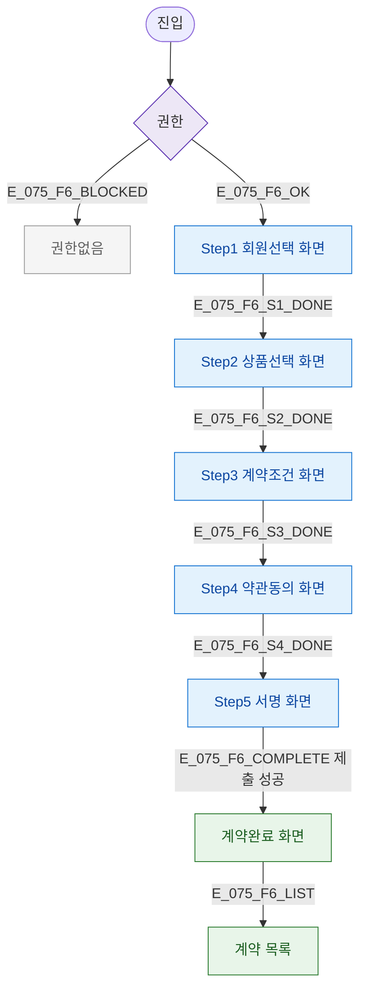

## 3. 다이어그램

```mermaid
flowchart TD
  ENTER([진입]) --> AUTH{권한}
  AUTH -->|E_075_F6_BLOCKED|BLOCKED[권한없음]
  AUTH -->|E_075_F6_OK|STEP1[Step1 회원선택 화면]

  STEP1 -->|E_075_F6_S1_DONE|STEP2[Step2 상품선택 화면]
  STEP2 -->|E_075_F6_S2_DONE|STEP3[Step3 계약조건 화면]
  STEP3 -->|E_075_F6_S3_DONE|STEP4[Step4 약관동의 화면]
  STEP4 -->|E_075_F6_S4_DONE|STEP5[Step5 서명 화면]

  STEP5 -->|E_075_F6_COMPLETE 제출 성공|DONE[계약완료 화면]
  DONE -->|E_075_F6_LIST|LIST[계약 목록]

  classDef screen fill:#E3F2FD,stroke:#1976D2,color:#0D47A1
  classDef rbacBlocked fill:#F5F5F5,stroke:#9E9E9E,color:#616161
  classDef success fill:#E8F5E9,stroke:#2E7D32,color:#1B5E20
  classDef system fill:#EDE7F6,stroke:#5E35B2

  class STEP1,STEP2,STEP3,STEP4,STEP5 screen
  class DONE,LIST success
  class BLOCKED rbacBlocked
  class AUTH system
```
