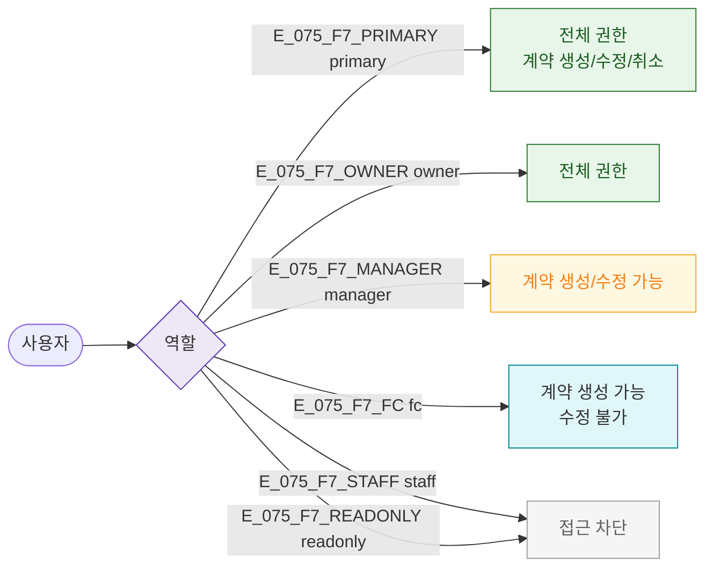

## 3. 다이어그램

```mermaid
flowchart LR
  USER([사용자]) --> ROLE{역할}

  ROLE -->|E_075_F7_PRIMARY primary|R_P[전체 권한\n계약 생성/수정/취소]
  ROLE -->|E_075_F7_OWNER owner|R_O[전체 권한]
  ROLE -->|E_075_F7_MANAGER manager|R_M[계약 생성/수정 가능]
  ROLE -->|E_075_F7_FC fc|R_FC[계약 생성 가능\n수정 불가]
  ROLE -->|E_075_F7_STAFF staff|R_BLOCKED[접근 차단]
  ROLE -->|E_075_F7_READONLY readonly|R_BLOCKED

  classDef success fill:#E8F5E9,stroke:#2E7D32,color:#1B5E20
  classDef warning fill:#FFF8E1,stroke:#F9A825,color:#F57F17
  classDef info fill:#E0F7FA,stroke:#00838F
  classDef rbacBlocked fill:#F5F5F5,stroke:#9E9E9E,color:#616161
  classDef system fill:#EDE7F6,stroke:#5E35B2

  class R_P,R_O success
  class R_M warning
  class R_FC info
  class R_BLOCKED rbacBlocked
  class ROLE system
```
