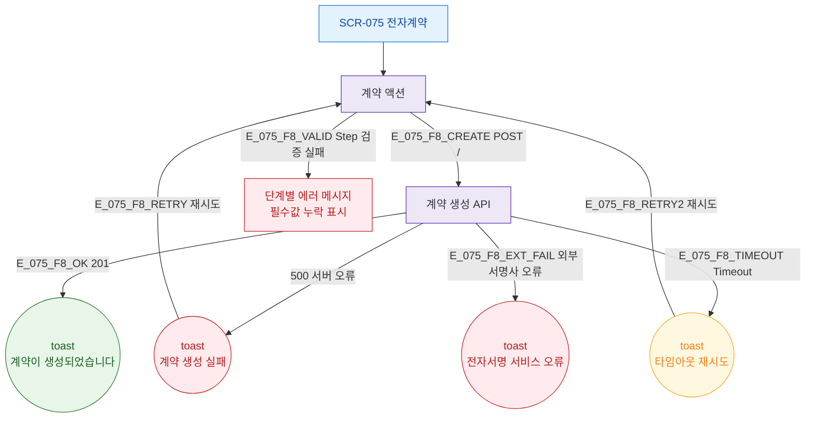

## 3. 다이어그램

```mermaid
flowchart TD
  SCR_075[SCR-075 전자계약] --> ACT[계약 액션]

  ACT -->|E_075_F8_CREATE POST /|API[계약 생성 API]
  API -->|E_075_F8_OK 201|T_OK((toast\n계약이 생성되었습니다))
  API -->|500 서버 오류|T_ERR((toast\n계약 생성 실패))
  API -->|E_075_F8_TIMEOUT Timeout|T_TIMEOUT((toast\n타임아웃 재시도))
  API -->|E_075_F8_EXT_FAIL 외부 서명사 오류|T_EXT((toast\n전자서명 서비스 오류))

  ACT -->|E_075_F8_VALID Step 검증 실패|STEP_ERR[단계별 에러 메시지\n필수값 누락 표시]

  T_ERR -->|E_075_F8_RETRY 재시도|ACT
  T_TIMEOUT -->|E_075_F8_RETRY2 재시도|ACT

  classDef screen fill:#E3F2FD,stroke:#1976D2,color:#0D47A1
  classDef success fill:#E8F5E9,stroke:#2E7D32,color:#1B5E20
  classDef error fill:#FFEBEE,stroke:#C62828,color:#B71C1C
  classDef warning fill:#FFF8E1,stroke:#F9A825,color:#F57F17
  classDef system fill:#EDE7F6,stroke:#5E35B2

  class SCR_075 screen
  class T_OK success
  class T_ERR,T_EXT,STEP_ERR error
  class T_TIMEOUT warning
  class API,ACT system
```
