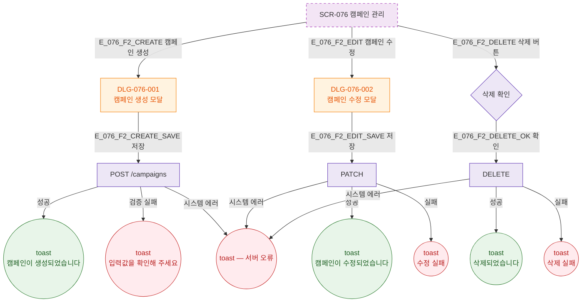

## 1. 목적

캠페인 생성/수정/삭제 Happy Path를 TC 원천으로 제공한다.

## 2. 전제조건

- SCR-076 렌더링 완료

## 3. 다이어그램

```mermaid
flowchart TD
  SCR_076[SCR-076 캠페인 관리]

  SCR_076 -->|E_076_F2_CREATE 캠페인 생성|DLG_001[DLG-076-001\n캠페인 생성 모달]
  SCR_076 -->|E_076_F2_EDIT 캠페인 수정|DLG_002[DLG-076-002\n캠페인 수정 모달]
  SCR_076 -->|E_076_F2_DELETE 삭제 버튼|CONFIRM{삭제 확인}

  DLG_001 -->|E_076_F2_CREATE_SAVE 저장|API_CREATE[POST /campaigns]
  DLG_002 -->|E_076_F2_EDIT_SAVE 저장|API_EDIT[PATCH]
  CONFIRM -->|E_076_F2_DELETE_OK 확인|API_DELETE[DELETE]

  API_CREATE -->|성공|T_OK((toast\n캠페인이 생성되었습니다))
  API_CREATE -->|검증 실패|T_ERR((toast\n입력값을 확인해 주세요))
  API_CREATE -->|시스템 에러|T_SYS((toast — 서버 오류))

  API_EDIT -->|성공|T_OK2((toast\n캠페인이 수정되었습니다))
  API_EDIT -->|실패|T_ERR2((toast\n수정 실패))
  API_EDIT -->|시스템 에러|T_SYS

  API_DELETE -->|성공|T_DEL((toast\n삭제되었습니다))
  API_DELETE -->|실패|T_ERR3((toast\n삭제 실패))
  API_DELETE -->|시스템 에러|T_SYS

  classDef newFeature fill:#F3E5F5,stroke:#9C27B0,stroke-dasharray:5 5
  classDef modal fill:#FFF3E0,stroke:#F57C00,color:#E65100
  classDef success fill:#E8F5E9,stroke:#2E7D32,color:#1B5E20
  classDef error fill:#FFEBEE,stroke:#C62828,color:#B71C1C
  classDef system fill:#EDE7F6,stroke:#5E35B2

  class SCR_076 newFeature
  class DLG_001,DLG_002 modal
  class T_OK,T_OK2,T_DEL success
  class T_ERR,T_ERR2,T_ERR3,T_SYS error
  class API_CREATE,API_EDIT,API_DELETE,CONFIRM system
```
