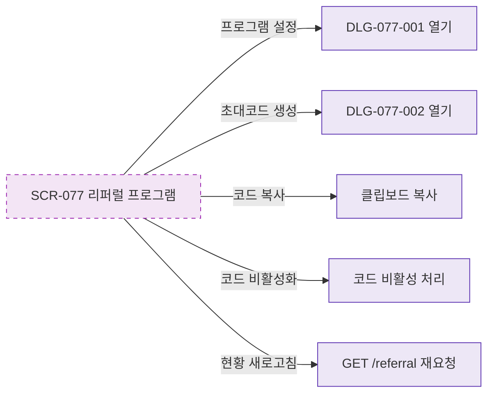

## 3. 다이어그램

```mermaid
flowchart LR
  SCR_077[SCR-077 리퍼럴 프로그램]

  SCR_077 -->|프로그램 설정|BTN_SETTING[DLG-077-001 열기]
  SCR_077 -->|초대코드 생성|BTN_CODE[DLG-077-002 열기]
  SCR_077 -->|코드 복사|BTN_COPY[클립보드 복사]
  SCR_077 -->|코드 비활성화|BTN_DEACT[코드 비활성 처리]
  SCR_077 -->|현황 새로고침|BTN_REFRESH[GET /referral 재요청]

  classDef newFeature fill:#F3E5F5,stroke:#9C27B0,stroke-dasharray:5 5
  classDef system fill:#EDE7F6,stroke:#5E35B2

  class SCR_077 newFeature
  class BTN_SETTING,BTN_CODE,BTN_COPY,BTN_DEACT,BTN_REFRESH system
```
