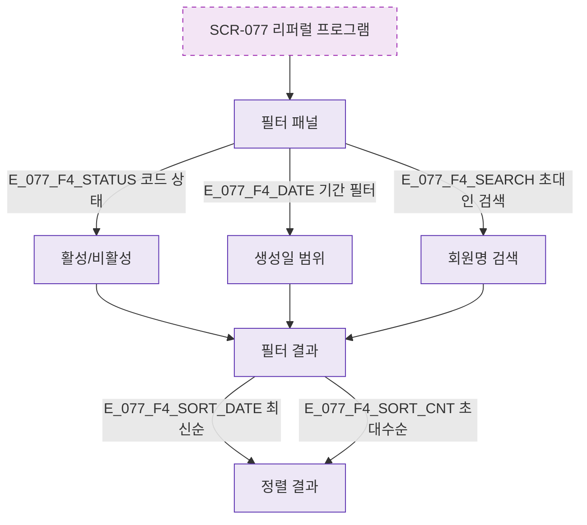

## 3. 다이어그램

```mermaid
flowchart TD
  SCR_077[SCR-077 리퍼럴 프로그램] --> FILTER[필터 패널]

  FILTER -->|E_077_F4_STATUS 코드 상태|F_STATUS[활성/비활성]
  FILTER -->|E_077_F4_DATE 기간 필터|F_DATE[생성일 범위]
  FILTER -->|E_077_F4_SEARCH 초대인 검색|F_SEARCH[회원명 검색]

  F_STATUS --> RESULT[필터 결과]
  F_DATE --> RESULT
  F_SEARCH --> RESULT

  RESULT -->|E_077_F4_SORT_DATE 최신순|SORTED[정렬 결과]
  RESULT -->|E_077_F4_SORT_CNT 초대수순|SORTED

  classDef newFeature fill:#F3E5F5,stroke:#9C27B0,stroke-dasharray:5 5
  classDef system fill:#EDE7F6,stroke:#5E35B2

  class SCR_077 newFeature
  class FILTER,F_STATUS,F_DATE,F_SEARCH,RESULT,SORTED system
```
