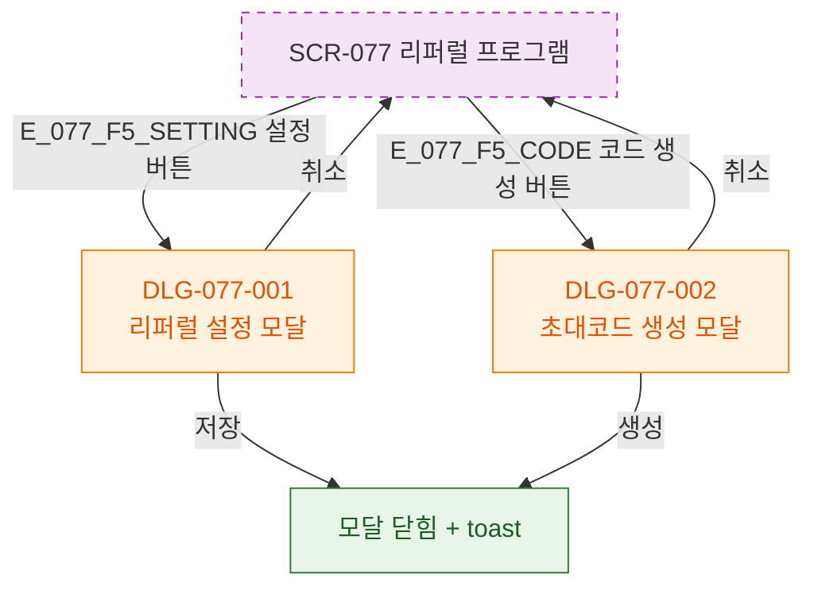

## 3. 다이어그램

```mermaid
flowchart TD
  SCR_077[SCR-077 리퍼럴 프로그램]

  SCR_077 -->|E_077_F5_SETTING 설정 버튼|DLG_001[DLG-077-001\n리퍼럴 설정 모달]
  SCR_077 -->|E_077_F5_CODE 코드 생성 버튼|DLG_002[DLG-077-002\n초대코드 생성 모달]

  DLG_001 -->|저장|SAVED[모달 닫힘 + toast]
  DLG_001 -->|취소|SCR_077
  DLG_002 -->|생성|SAVED
  DLG_002 -->|취소|SCR_077

  classDef newFeature fill:#F3E5F5,stroke:#9C27B0,stroke-dasharray:5 5
  classDef modal fill:#FFF3E0,stroke:#F57C00,color:#E65100
  classDef success fill:#E8F5E9,stroke:#2E7D32,color:#1B5E20

  class SCR_077 newFeature
  class DLG_001,DLG_002 modal
  class SAVED success
```
