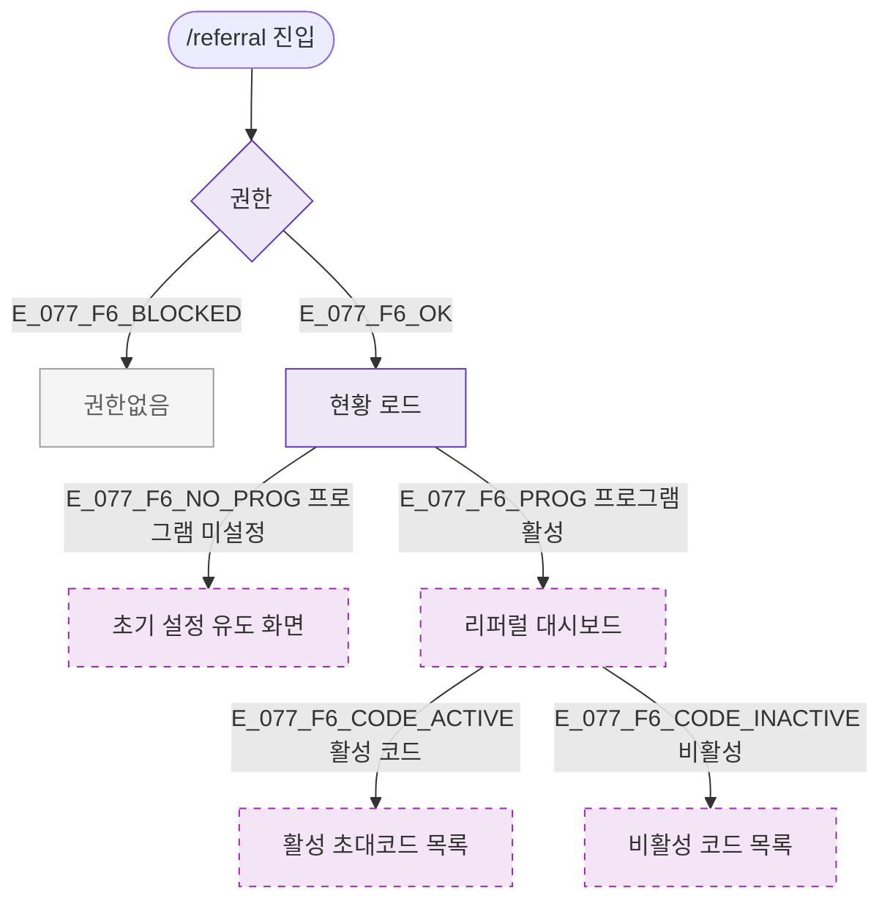

## 3. 다이어그램

```mermaid
flowchart TD
  ENTER([/referral 진입]) --> AUTH{권한}
  AUTH -->|E_077_F6_BLOCKED|BLOCKED[권한없음]
  AUTH -->|E_077_F6_OK|LOAD[현황 로드]

  LOAD -->|E_077_F6_NO_PROG 프로그램 미설정|SETUP[초기 설정 유도 화면]
  LOAD -->|E_077_F6_PROG 프로그램 활성|DASH[리퍼럴 대시보드]

  DASH -->|E_077_F6_CODE_ACTIVE 활성 코드|ACTIVE_LIST[활성 초대코드 목록]
  DASH -->|E_077_F6_CODE_INACTIVE 비활성|INACTIVE_LIST[비활성 코드 목록]

  classDef newFeature fill:#F3E5F5,stroke:#9C27B0,stroke-dasharray:5 5
  classDef rbacBlocked fill:#F5F5F5,stroke:#9E9E9E,color:#616161
  classDef system fill:#EDE7F6,stroke:#5E35B2

  class DASH,SETUP,ACTIVE_LIST,INACTIVE_LIST newFeature
  class BLOCKED rbacBlocked
  class AUTH,LOAD system
```
