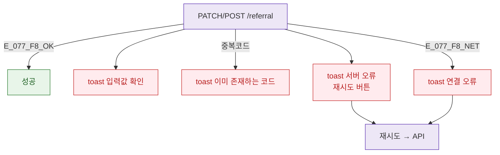

## 3. 다이어그램

```mermaid
flowchart TD
  API[PATCH/POST /referral] -->|E_077_F8_OK|SUCCESS[성공]
  API --> ERR_400[toast 입력값 확인]
  API -->|중복코드|ERR_409[toast 이미 존재하는 코드]
  API --> ERR_500[toast 서버 오류\n재시도 버튼]
  API -->|E_077_F8_NET|ERR_NET[toast 연결 오류]

  ERR_500 --> RETRY[재시도 → API]
  ERR_NET --> RETRY

  classDef success fill:#E8F5E9,stroke:#2E7D32,color:#1B5E20
  classDef error fill:#FFEBEE,stroke:#C62828,color:#B71C1C
  classDef system fill:#EDE7F6,stroke:#5E35B2

  class SUCCESS success
  class ERR_400,ERR_409,ERR_500,ERR_NET error
  class API,RETRY system
```
