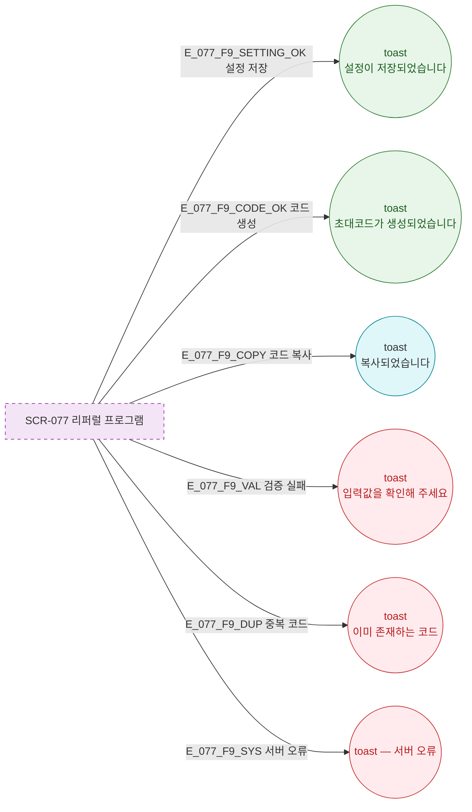

## 3. 다이어그램

```mermaid
flowchart LR
  SCR_077[SCR-077 리퍼럴 프로그램]

  SCR_077 -->|E_077_F9_SETTING_OK 설정 저장|T1((toast\n설정이 저장되었습니다))
  SCR_077 -->|E_077_F9_CODE_OK 코드 생성|T2((toast\n초대코드가 생성되었습니다))
  SCR_077 -->|E_077_F9_COPY 코드 복사|T3((toast\n복사되었습니다))
  SCR_077 -->|E_077_F9_VAL 검증 실패|T4((toast\n입력값을 확인해 주세요))
  SCR_077 -->|E_077_F9_DUP 중복 코드|T5((toast\n이미 존재하는 코드))
  SCR_077 -->|E_077_F9_SYS 서버 오류|T6((toast — 서버 오류))

  classDef newFeature fill:#F3E5F5,stroke:#9C27B0,stroke-dasharray:5 5
  classDef success fill:#E8F5E9,stroke:#2E7D32,color:#1B5E20
  classDef info fill:#E0F7FA,stroke:#00838F
  classDef error fill:#FFEBEE,stroke:#C62828,color:#B71C1C

  class SCR_077 newFeature
  class T1,T2 success
  class T3 info
  class T4,T5,T6 error
```
