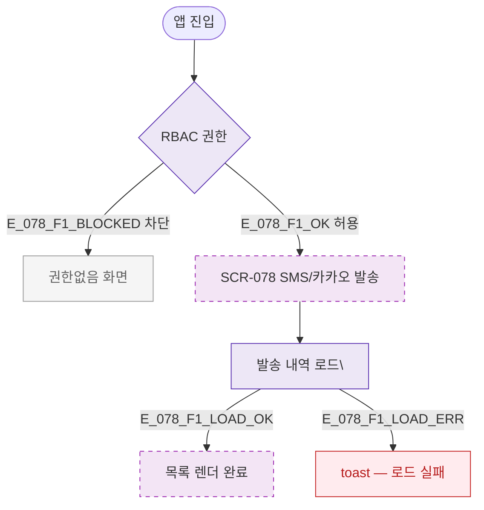

## 3. 다이어그램

```mermaid
flowchart TD
  START([앱 진입]) --> AUTH{RBAC 권한}
  AUTH -->|E_078_F1_BLOCKED 차단|BLOCKED[권한없음 화면]
  AUTH -->|E_078_F1_OK 허용|SCR_078[SCR-078 SMS/카카오 발송]

  SCR_078 --> LOAD[발송 내역 로드\]
  LOAD -->|E_078_F1_LOAD_OK|READY[목록 렌더 완료]
  LOAD -->|E_078_F1_LOAD_ERR|ERR[toast — 로드 실패]

  classDef newFeature fill:#F3E5F5,stroke:#9C27B0,stroke-dasharray:5 5
  classDef error fill:#FFEBEE,stroke:#C62828,color:#B71C1C
  classDef rbacBlocked fill:#F5F5F5,stroke:#9E9E9E,color:#616161
  classDef system fill:#EDE7F6,stroke:#5E35B2

  class SCR_078,READY newFeature
  class BLOCKED rbacBlocked
  class ERR error
  class AUTH,LOAD system
```
