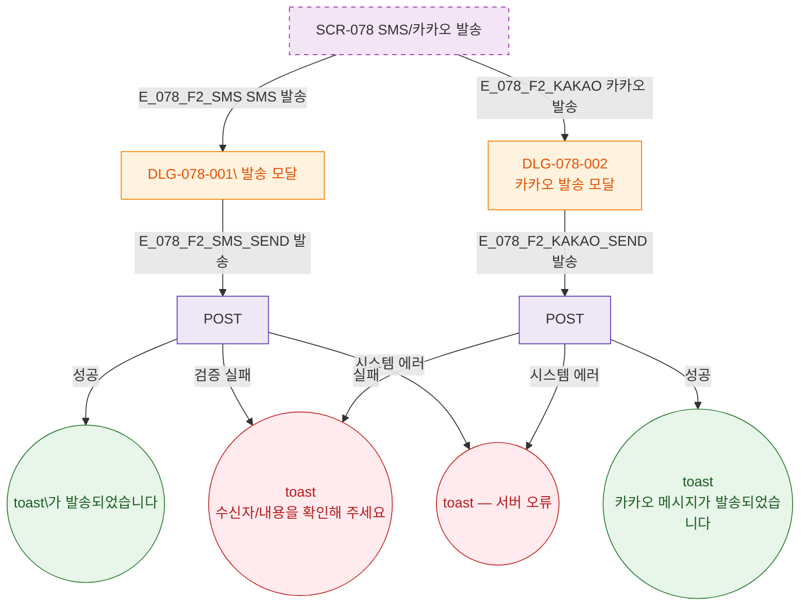

## 1. 목적

SMS/카카오 메시지 발송 Happy Path를 TC 원천으로 제공한다.

## 2. 전제조건

- SCR-078 렌더링 완료

## 3. 다이어그램

```mermaid
flowchart TD
  SCR_078[SCR-078 SMS/카카오 발송]

  SCR_078 -->|E_078_F2_SMS SMS 발송|DLG_001[DLG-078-001\ 발송 모달]
  SCR_078 -->|E_078_F2_KAKAO 카카오 발송|DLG_002[DLG-078-002\n카카오 발송 모달]

  DLG_001 -->|E_078_F2_SMS_SEND 발송|API_SMS[POST]
  DLG_002 -->|E_078_F2_KAKAO_SEND 발송|API_KAKAO[POST]

  API_SMS -->|성공|T_OK1((toast\가 발송되었습니다))
  API_SMS -->|검증 실패|T_ERR((toast\n수신자/내용을 확인해 주세요))
  API_SMS -->|시스템 에러|T_SYS((toast — 서버 오류))

  API_KAKAO -->|성공|T_OK2((toast\n카카오 메시지가 발송되었습니다))
  API_KAKAO -->|실패|T_ERR
  API_KAKAO -->|시스템 에러|T_SYS

  classDef newFeature fill:#F3E5F5,stroke:#9C27B0,stroke-dasharray:5 5
  classDef modal fill:#FFF3E0,stroke:#F57C00,color:#E65100
  classDef success fill:#E8F5E9,stroke:#2E7D32,color:#1B5E20
  classDef error fill:#FFEBEE,stroke:#C62828,color:#B71C1C
  classDef system fill:#EDE7F6,stroke:#5E35B2

  class SCR_078 newFeature
  class DLG_001,DLG_002 modal
  class T_OK1,T_OK2 success
  class T_ERR,T_SYS error
  class API_SMS,API_KAKAO system
```
