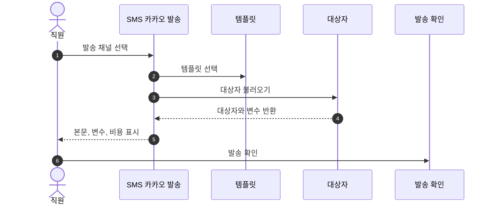

# SCR-078 SMS 카카오 발송 메인 인터랙션

```mermaid
sequenceDiagram
    autonumber
    actor Staff as 직원
    participant Screen as SMS 카카오 발송
    participant Template as 템플릿
    participant Target as 대상자
    participant Confirm as 발송 확인

    Staff->>Screen: 발송 채널 선택
    Screen->>Template: 템플릿 선택
    Screen->>Target: 대상자 불러오기
    Target-->>Screen: 대상자와 변수 반환
    Screen-->>Staff: 본문, 변수, 비용 표시
    Staff->>Confirm: 발송 확인
```
