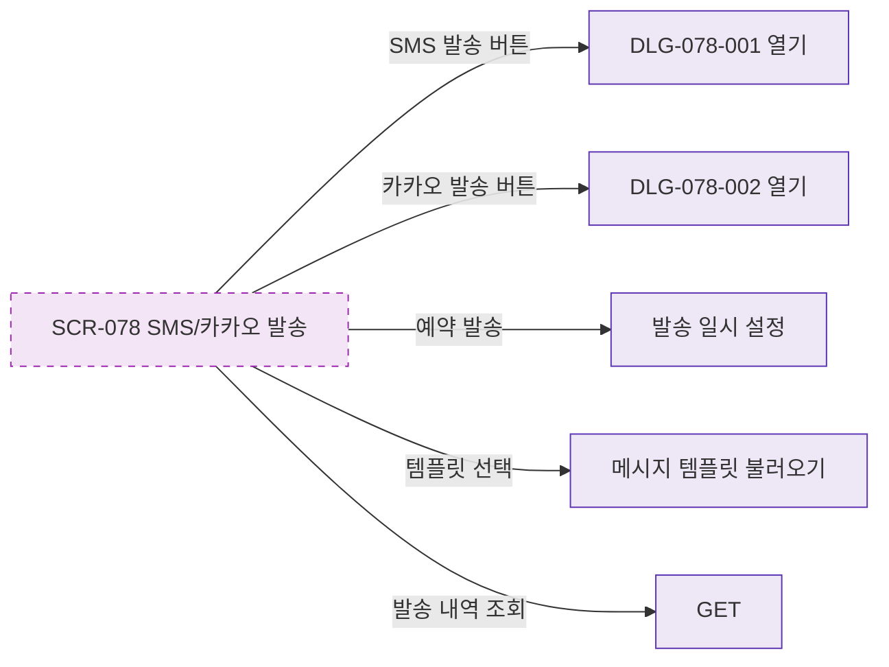

## 3. 다이어그램

```mermaid
flowchart LR
  SCR_078[SCR-078 SMS/카카오 발송]

  SCR_078 -->|SMS 발송 버튼|BTN_SMS[DLG-078-001 열기]
  SCR_078 -->|카카오 발송 버튼|BTN_KAKAO[DLG-078-002 열기]
  SCR_078 -->|예약 발송|BTN_SCHEDULE[발송 일시 설정]
  SCR_078 -->|템플릿 선택|BTN_TMPL[메시지 템플릿 불러오기]
  SCR_078 -->|발송 내역 조회|BTN_HISTORY[GET]

  classDef newFeature fill:#F3E5F5,stroke:#9C27B0,stroke-dasharray:5 5
  classDef system fill:#EDE7F6,stroke:#5E35B2

  class SCR_078 newFeature
  class BTN_SMS,BTN_KAKAO,BTN_SCHEDULE,BTN_TMPL,BTN_HISTORY system
```
