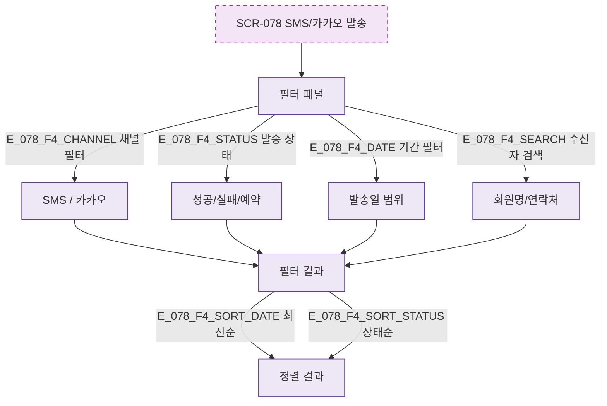

## 3. 다이어그램

```mermaid
flowchart TD
  SCR_078[SCR-078 SMS/카카오 발송] --> FILTER[필터 패널]

  FILTER -->|E_078_F4_CHANNEL 채널 필터|F_CH[SMS / 카카오]
  FILTER -->|E_078_F4_STATUS 발송 상태|F_ST[성공/실패/예약]
  FILTER -->|E_078_F4_DATE 기간 필터|F_DATE[발송일 범위]
  FILTER -->|E_078_F4_SEARCH 수신자 검색|F_SEARCH[회원명/연락처]

  F_CH --> RESULT[필터 결과]
  F_ST --> RESULT
  F_DATE --> RESULT
  F_SEARCH --> RESULT

  RESULT -->|E_078_F4_SORT_DATE 최신순|SORTED[정렬 결과]
  RESULT -->|E_078_F4_SORT_STATUS 상태순|SORTED

  classDef newFeature fill:#F3E5F5,stroke:#9C27B0,stroke-dasharray:5 5
  classDef system fill:#EDE7F6,stroke:#5E35B2

  class SCR_078 newFeature
  class FILTER,F_CH,F_ST,F_DATE,F_SEARCH,RESULT,SORTED system
```
