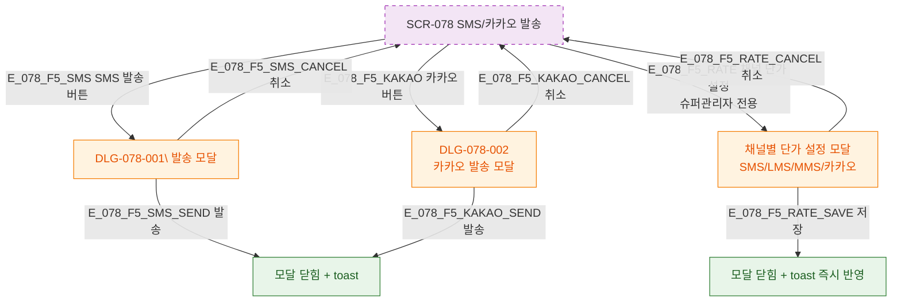

## 3. 다이어그램

```mermaid
flowchart TD
  SCR_078[SCR-078 SMS/카카오 발송]

  SCR_078 -->|E_078_F5_SMS SMS 발송 버튼|DLG_001[DLG-078-001\ 발송 모달]
  SCR_078 -->|E_078_F5_KAKAO 카카오 버튼|DLG_002[DLG-078-002\n카카오 발송 모달]
  SCR_078 -->|E_078_F5_RATE 채널 단가 설정\n슈퍼관리자 전용|DLG_RATE[채널별 단가 설정 모달\nSMS/LMS/MMS/카카오]
  DLG_RATE -->|E_078_F5_RATE_SAVE 저장|RATE_SAVED[모달 닫힘 + toast 즉시 반영]
  DLG_RATE -->|E_078_F5_RATE_CANCEL 취소|SCR_078

  DLG_001 -->|E_078_F5_SMS_SEND 발송|SENT[모달 닫힘 + toast]
  DLG_001 -->|E_078_F5_SMS_CANCEL 취소|SCR_078
  DLG_002 -->|E_078_F5_KAKAO_SEND 발송|SENT
  DLG_002 -->|E_078_F5_KAKAO_CANCEL 취소|SCR_078

  classDef newFeature fill:#F3E5F5,stroke:#9C27B0,stroke-dasharray:5 5
  classDef modal fill:#FFF3E0,stroke:#F57C00,color:#E65100
  classDef success fill:#E8F5E9,stroke:#2E7D32,color:#1B5E20

  class SCR_078 newFeature
  class DLG_001,DLG_002,DLG_RATE modal
  class SENT,RATE_SAVED success
```
