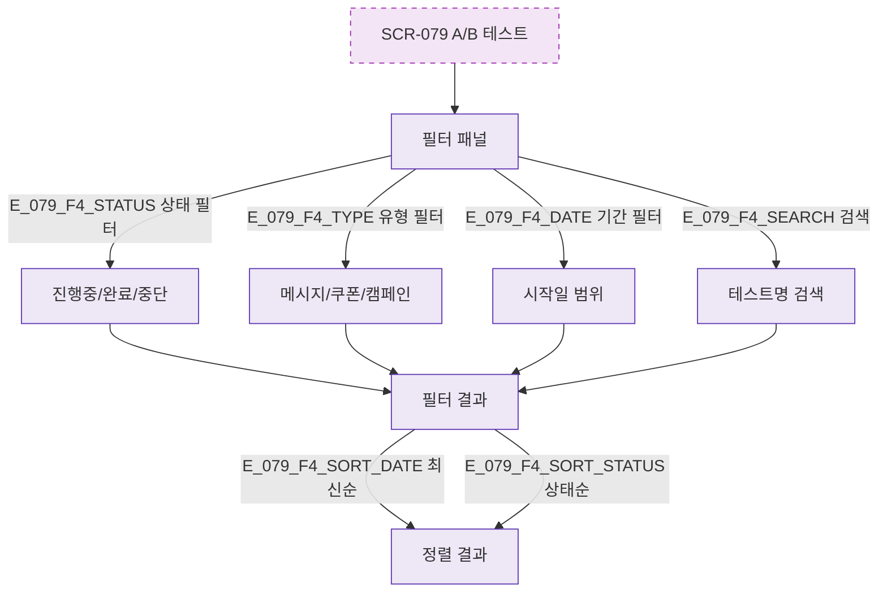

## 3. 다이어그램

```mermaid
flowchart TD
  SCR_079[SCR-079 A/B 테스트] --> FILTER[필터 패널]

  FILTER -->|E_079_F4_STATUS 상태 필터|F_STATUS[진행중/완료/중단]
  FILTER -->|E_079_F4_TYPE 유형 필터|F_TYPE[메시지/쿠폰/캠페인]
  FILTER -->|E_079_F4_DATE 기간 필터|F_DATE[시작일 범위]
  FILTER -->|E_079_F4_SEARCH 검색|F_SEARCH[테스트명 검색]

  F_STATUS --> RESULT[필터 결과]
  F_TYPE --> RESULT
  F_DATE --> RESULT
  F_SEARCH --> RESULT

  RESULT -->|E_079_F4_SORT_DATE 최신순|SORTED[정렬 결과]
  RESULT -->|E_079_F4_SORT_STATUS 상태순|SORTED

  classDef newFeature fill:#F3E5F5,stroke:#9C27B0,stroke-dasharray:5 5
  classDef system fill:#EDE7F6,stroke:#5E35B2

  class SCR_079 newFeature
  class FILTER,F_STATUS,F_TYPE,F_DATE,F_SEARCH,RESULT,SORTED system
```
