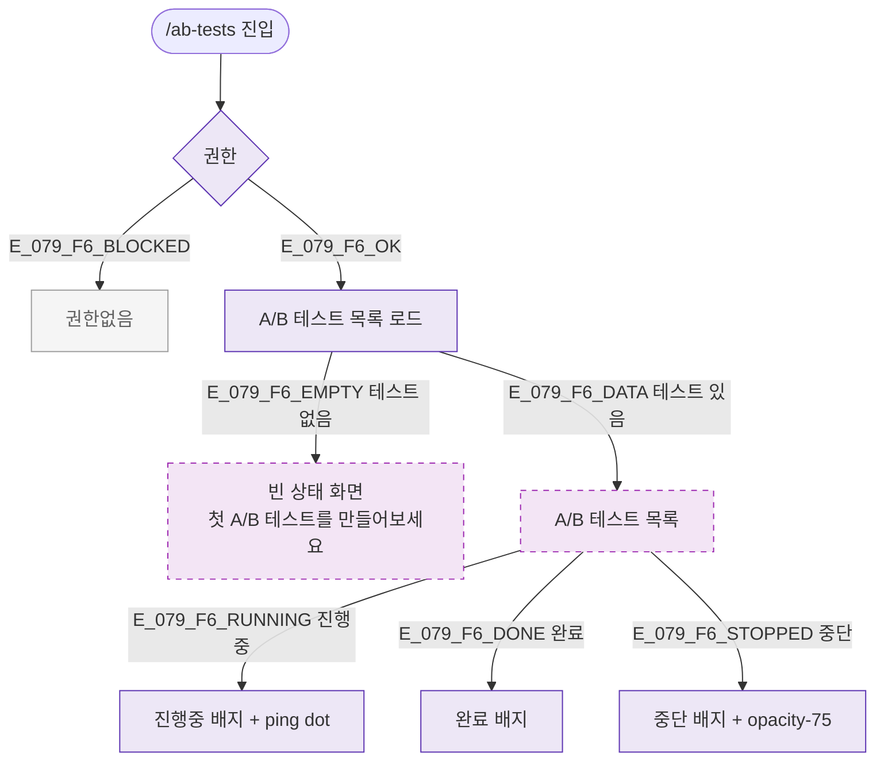

## 3. 다이어그램

```mermaid
flowchart TD
  ENTER([/ab-tests 진입]) --> AUTH{권한}
  AUTH -->|E_079_F6_BLOCKED|BLOCKED[권한없음]
  AUTH -->|E_079_F6_OK|LOAD[A/B 테스트 목록 로드]

  LOAD -->|E_079_F6_EMPTY 테스트 없음|EMPTY[빈 상태 화면\n첫 A/B 테스트를 만들어보세요]
  LOAD -->|E_079_F6_DATA 테스트 있음|LIST[A/B 테스트 목록]

  LIST -->|E_079_F6_RUNNING 진행중|STYLE_RUNNING[진행중 배지 + ping dot]
  LIST -->|E_079_F6_DONE 완료|STYLE_DONE[완료 배지]
  LIST -->|E_079_F6_STOPPED 중단|STYLE_STOPPED[중단 배지 + opacity-75]

  classDef newFeature fill:#F3E5F5,stroke:#9C27B0,stroke-dasharray:5 5
  classDef rbacBlocked fill:#F5F5F5,stroke:#9E9E9E,color:#616161
  classDef system fill:#EDE7F6,stroke:#5E35B2

  class LIST,EMPTY newFeature
  class BLOCKED rbacBlocked
  class STYLE_RUNNING,STYLE_DONE,STYLE_STOPPED,AUTH,LOAD system
```
