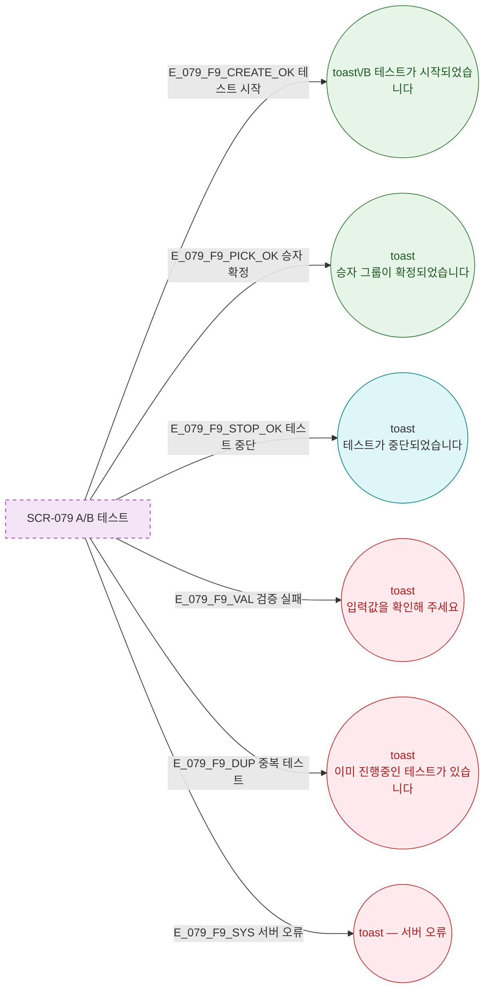

## 3. 다이어그램

```mermaid
flowchart LR
  SCR_079[SCR-079 A/B 테스트]

  SCR_079 -->|E_079_F9_CREATE_OK 테스트 시작|T1((toast\/B 테스트가 시작되었습니다))
  SCR_079 -->|E_079_F9_PICK_OK 승자 확정|T2((toast\n승자 그룹이 확정되었습니다))
  SCR_079 -->|E_079_F9_STOP_OK 테스트 중단|T3((toast\n테스트가 중단되었습니다))
  SCR_079 -->|E_079_F9_VAL 검증 실패|T4((toast\n입력값을 확인해 주세요))
  SCR_079 -->|E_079_F9_DUP 중복 테스트|T5((toast\n이미 진행중인 테스트가 있습니다))
  SCR_079 -->|E_079_F9_SYS 서버 오류|T6((toast — 서버 오류))

  classDef newFeature fill:#F3E5F5,stroke:#9C27B0,stroke-dasharray:5 5
  classDef success fill:#E8F5E9,stroke:#2E7D32,color:#1B5E20
  classDef info fill:#E0F7FA,stroke:#00838F
  classDef error fill:#FFEBEE,stroke:#C62828,color:#B71C1C

  class SCR_079 newFeature
  class T1,T2 success
  class T3 info
  class T4,T5,T6 error
```
