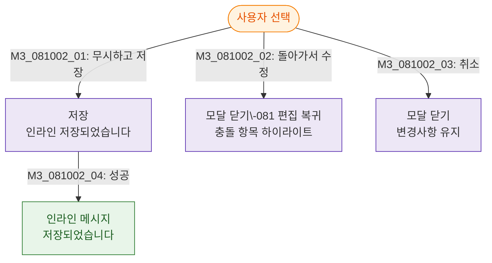

## 다이어그램

```mermaid
flowchart TD
    Action([사용자 선택]) -->|"M3_081002_01: 무시하고 저장"|ForceSave[저장\n인라인 저장되었습니다]
    Action -->|"M3_081002_02: 돌아가서 수정"|FixConflict[모달 닫기\-081 편집 복귀\n충돌 항목 하이라이트]
    Action -->|"M3_081002_03: 취소"|CancelPath[모달 닫기\n변경사항 유지]

    ForceSave -->|"M3_081002_04: 성공"|T_SaveOK[인라인 메시지\n저장되었습니다]

    classDef modal fill:#FFF3E0,stroke:#F57C00,color:#E65100
    classDef success fill:#E8F5E9,stroke:#2E7D32,color:#1B5E20
    classDef system fill:#EDE7F6,stroke:#5E35B2
    class Action modal
    class T_SaveOK success
    class ForceSave,FixConflict,CancelPath system
```
