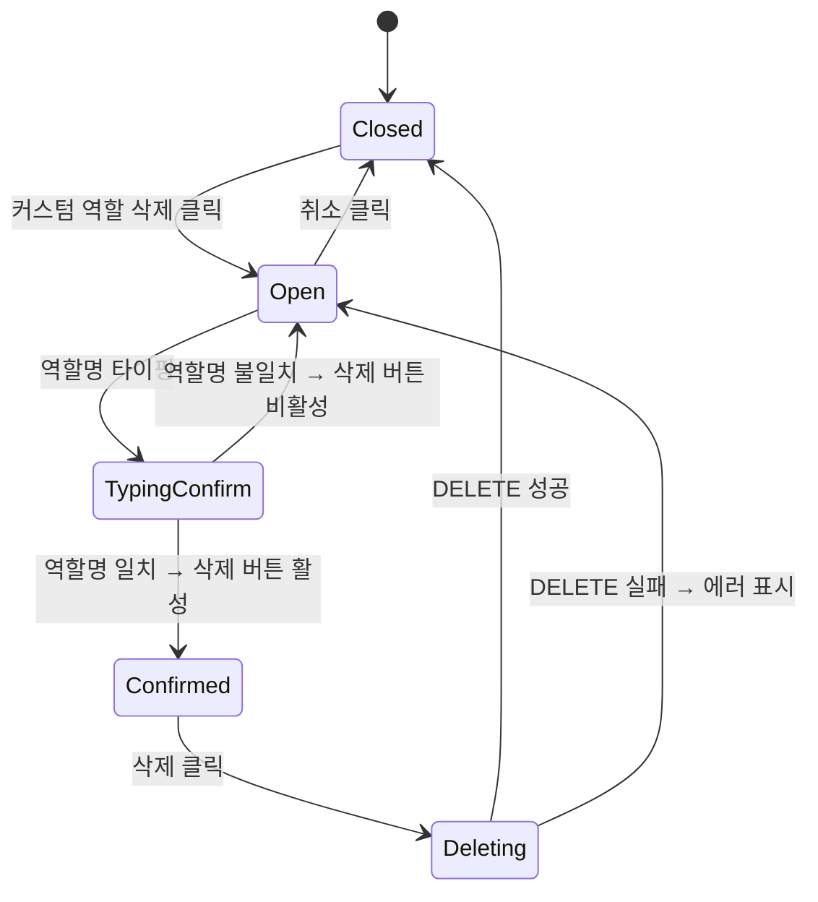

## 다이어그램

```mermaid
stateDiagram-v2
    [*] --> Closed
    Closed --> Open: 커스텀 역할 삭제 클릭
    Open --> TypingConfirm: 역할명 타이핑
    TypingConfirm --> Confirmed: 역할명 일치 → 삭제 버튼 활성
    TypingConfirm --> Open: 역할명 불일치 → 삭제 버튼 비활성
    Confirmed --> Deleting: 삭제 클릭
    Deleting --> Closed: DELETE 성공
    Deleting --> Open: DELETE 실패 → 에러 표시
    Open --> Closed: 취소 클릭
```

## 모달 속성
| 항목 | 값 |
|------|-----|
| variant | danger |
| title | 역할 삭제 |
| description | 이 역할을 삭제하시겠습니까? 삭제 확인을 위해 역할명을 입력해 주세요. |
| | 삭제 |
| | 취소 |
| | {} |
