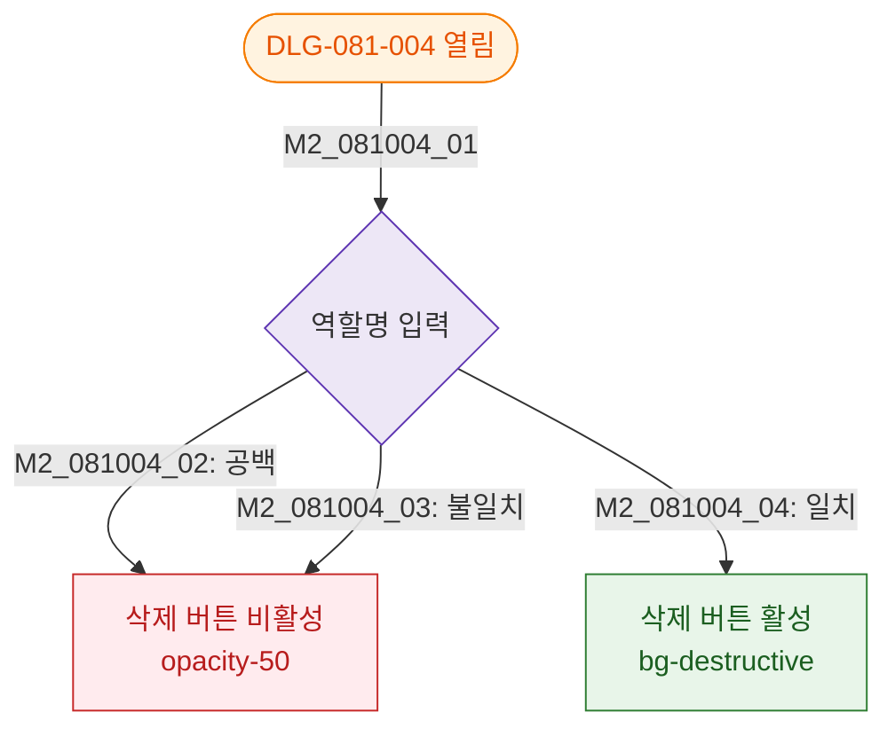

## 다이어그램

```mermaid
flowchart TD
    Open([DLG-081-004 열림]) -->|M2_081004_01|TypeInput{역할명 입력}
    TypeInput -->|"M2_081004_02: 공백"|BtnDisabled[삭제 버튼 비활성\nopacity-50]
    TypeInput -->|"M2_081004_03: 불일치"|BtnDisabled
    TypeInput -->|"M2_081004_04: 일치"|BtnEnabled[삭제 버튼 활성\nbg-destructive]

    classDef modal fill:#FFF3E0,stroke:#F57C00,color:#E65100
    classDef error fill:#FFEBEE,stroke:#C62828,color:#B71C1C
    classDef success fill:#E8F5E9,stroke:#2E7D32,color:#1B5E20
    classDef system fill:#EDE7F6,stroke:#5E35B2
    class Open modal
    class BtnEnabled success
    class BtnDisabled error
    class TypeInput system
```
