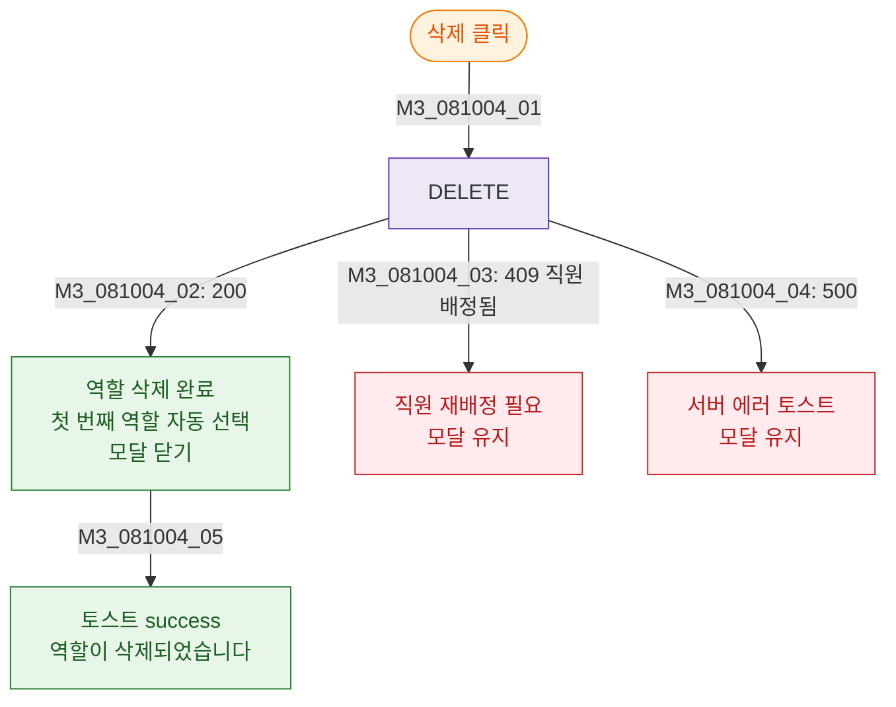

## 다이어그램

```mermaid
flowchart TD
    Action([삭제 클릭]) -->|M3_081004_01|ACT_Delete[DELETE]
    ACT_Delete -->|"M3_081004_02: 200"|RoleDeleted[역할 삭제 완료\n첫 번째 역할 자동 선택\n모달 닫기]
    ACT_Delete -->|"M3_081004_03: 409 직원 배정됨"|E_Assigned[직원 재배정 필요\n모달 유지]
    ACT_Delete -->|"M3_081004_04: 500"|E_Server[서버 에러 토스트\n모달 유지]

    RoleDeleted -->|M3_081004_05|T_DeleteOK[토스트 success\n역할이 삭제되었습니다]

    classDef modal fill:#FFF3E0,stroke:#F57C00,color:#E65100
    classDef success fill:#E8F5E9,stroke:#2E7D32,color:#1B5E20
    classDef error fill:#FFEBEE,stroke:#C62828,color:#B71C1C
    classDef system fill:#EDE7F6,stroke:#5E35B2
    class Action modal
    class RoleDeleted,T_DeleteOK success
    class E_Assigned,E_Server error
    class ACT_Delete system
```
