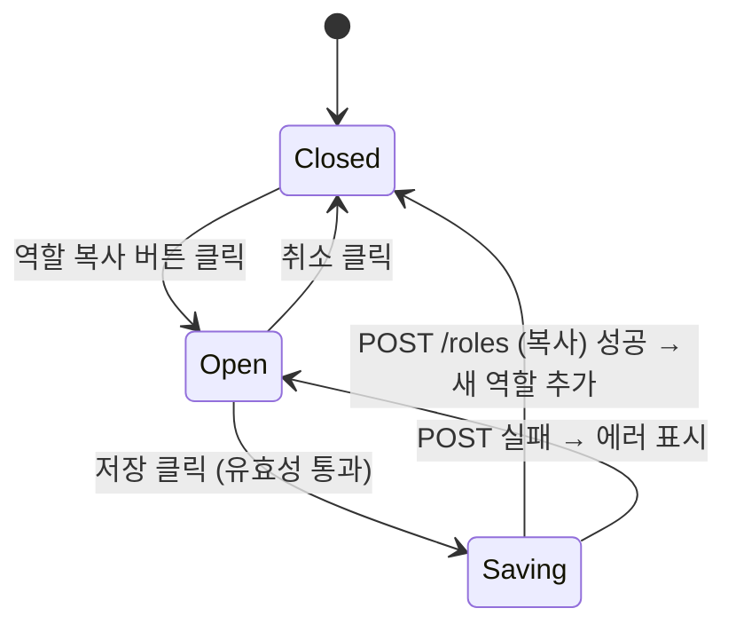

## 다이어그램

```mermaid
stateDiagram-v2
    [*] --> Closed
    Closed --> Open: 역할 복사 버튼 클릭
    Open --> Saving: 저장 클릭 (유효성 통과)
    Open --> Closed: 취소 클릭
    Saving --> Closed: POST /roles (복사) 성공 → 새 역할 추가
    Saving --> Open: POST 실패 → 에러 표시
```

## 모달 속성
| 항목 | 값 |
|------|-----|
| variant | primary |
| title | 역할 복사 |
| description | {} 역할의 권한을 복사하여 새 역할을 생성합니다. |
| | 복사 생성 |
| | 취소 |
| fields | 새 역할 이름(필수), 새 역할 코드(필수) |
