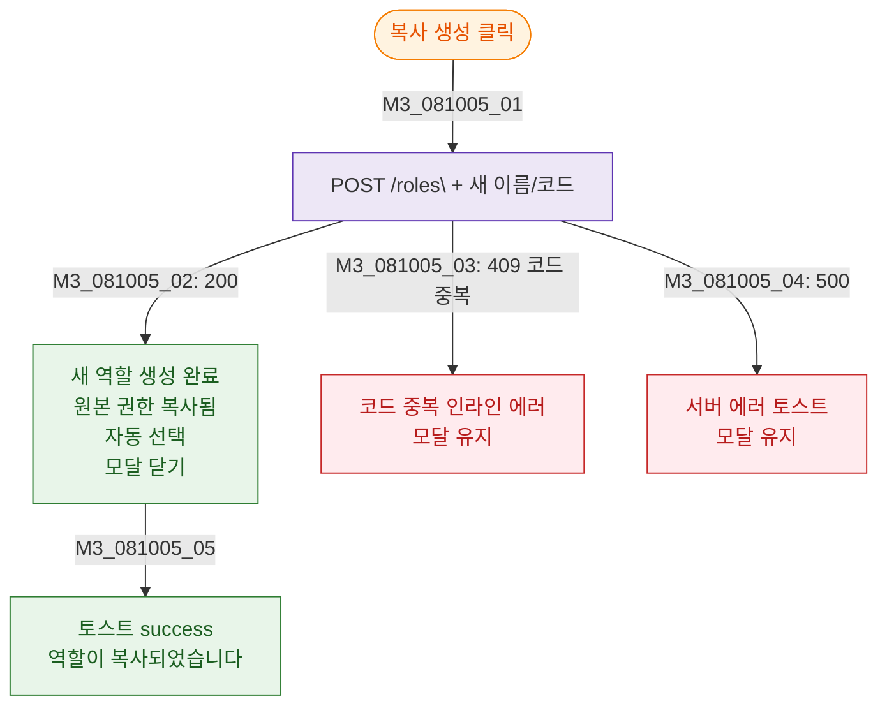

## 다이어그램

```mermaid
flowchart TD
    Action([복사 생성 클릭]) -->|M3_081005_01|ACT_Copy[POST /roles\ + 새 이름/코드]
    ACT_Copy -->|"M3_081005_02: 200"|RoleCopied[새 역할 생성 완료\n원본 권한 복사됨\n자동 선택\n모달 닫기]
    ACT_Copy -->|"M3_081005_03: 409 코드 중복"|E_Dup[코드 중복 인라인 에러\n모달 유지]
    ACT_Copy -->|"M3_081005_04: 500"|E_Server[서버 에러 토스트\n모달 유지]

    RoleCopied -->|M3_081005_05|T_CopyOK[토스트 success\n역할이 복사되었습니다]

    classDef modal fill:#FFF3E0,stroke:#F57C00,color:#E65100
    classDef success fill:#E8F5E9,stroke:#2E7D32,color:#1B5E20
    classDef error fill:#FFEBEE,stroke:#C62828,color:#B71C1C
    classDef system fill:#EDE7F6,stroke:#5E35B2
    class Action modal
    class RoleCopied,T_CopyOK success
    class E_Dup,E_Server error
    class ACT_Copy system
```
