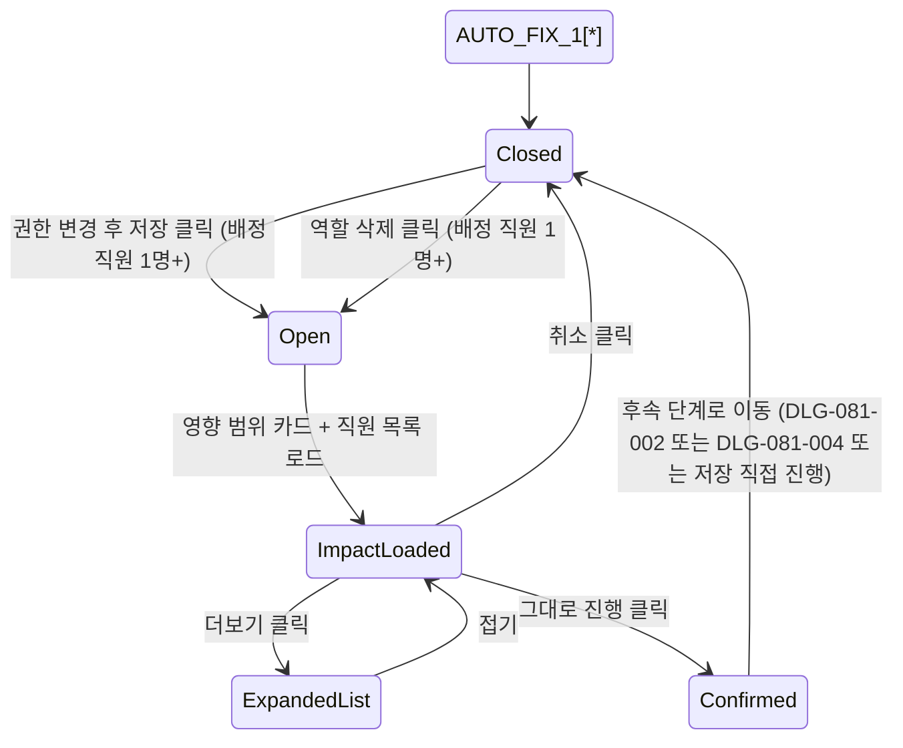

## 다이어그램

## 모달 속성

| 항목 | 값 |
|------|-----|
| variant | warning |
| title | 역할 변경 영향 분석 |
| description | 이 변경은 배정된 직원과 그 직원이 담당하는 회원에 영향이 있습니다. 영향 범위를 확인한 뒤 진행해 주세요. |
| primary action | 그대로 진행 |
| secondary action | 취소 |

## 사용 시나리오

- 권한 매트릭스 변경 후 [저장] 클릭 시 표시 → 영향 분석 후 충돌 검사(DLG-081-002) 또는 저장 진행
- 역할 삭제 클릭 시 표시 → 영향 분석 후 삭제 확인(DLG-081-004) 진행
- 배정 직원 0명이면 본 다이얼로그 생략, 후속 단계 직접 진행
