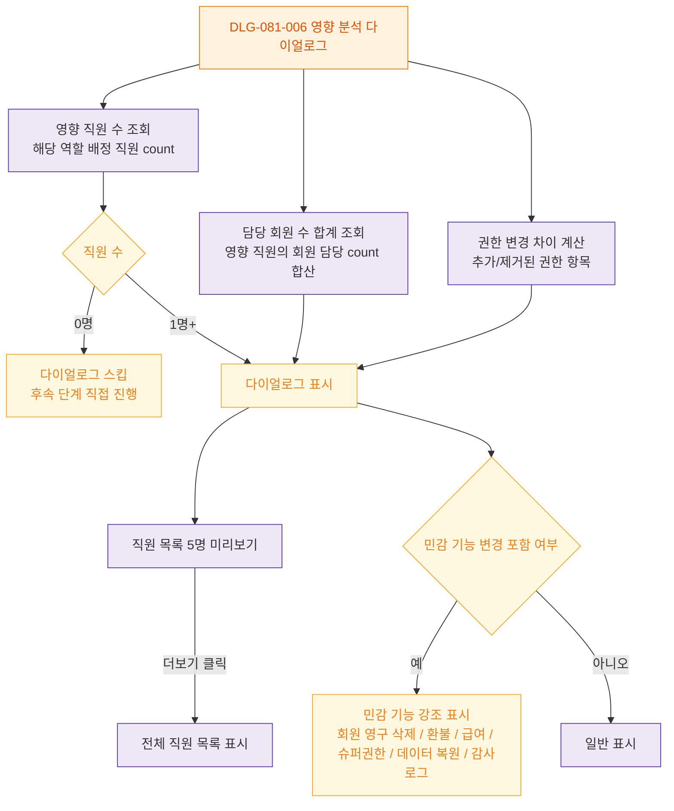

## 다이어그램

## 검증 규칙

| 검증 항목 | 통과 조건 | 실패 시 동작 |
|---|---|---|
| 영향 직원 수 계산 | 정상 응답 | 실패 시 다이얼로그 표시 + 진행 버튼 비활성, 재조회 안내 |
| 담당 회원 수 합산 | 정상 응답 | 실패 시 "회원 정보를 불러올 수 없습니다" 안내 |
| 권한 차이 비교 | 변경 사항 1개 이상 | 변경 없음이면 다이얼로그 표시 자체 스킵 |
| 민감 기능 포함 검사 | 6종 민감 액션 매트릭스 비교 | 포함 시 강조 표시 + superAdmin/primary 외 역할 저장 차단 안내 |
