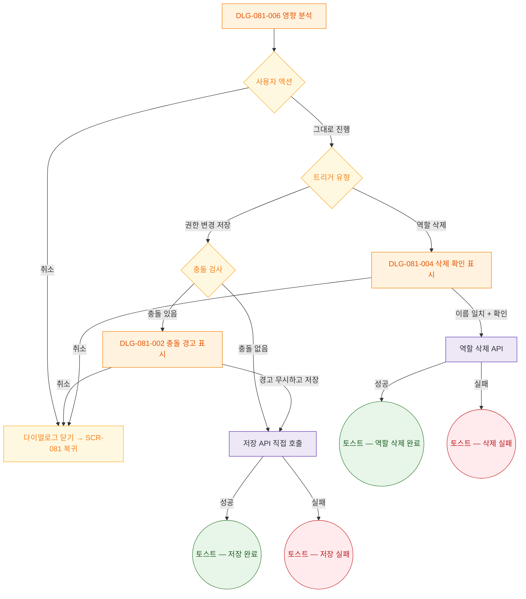

## 다이어그램

## 결과 분기 설명

| 트리거 유형 | 사용자 액션 | 후속 단계 |
|---|---|---|
| 권한 변경 후 저장 | 취소 | SCR-081 복귀, 변경 사항 유지 |
| 권한 변경 후 저장 | 그대로 진행 (충돌 있음) | DLG-081-002 충돌 경고 다이얼로그 표시 |
| 권한 변경 후 저장 | 그대로 진행 (충돌 없음) | 저장 API 직접 호출 |
| 역할 삭제 | 취소 | SCR-081 복귀 |
| 역할 삭제 | 그대로 진행 | DLG-081-004 삭제 확인 다이얼로그 표시 (이름 입력 필요) |

## 비즈니스 규칙

- 영향 분석 진행을 취소하더라도 SCR-081의 변경 사항(권한 매트릭스 편집 상태)은 유지된다
- 민감 기능 포함 변경이고 사용자 권한이 superAdmin/primary가 아니면 진행 버튼이 비활성화된다
- 역할 삭제 후속의 DLG-081-004는 직원 재배정 입력 필드가 필수이다
