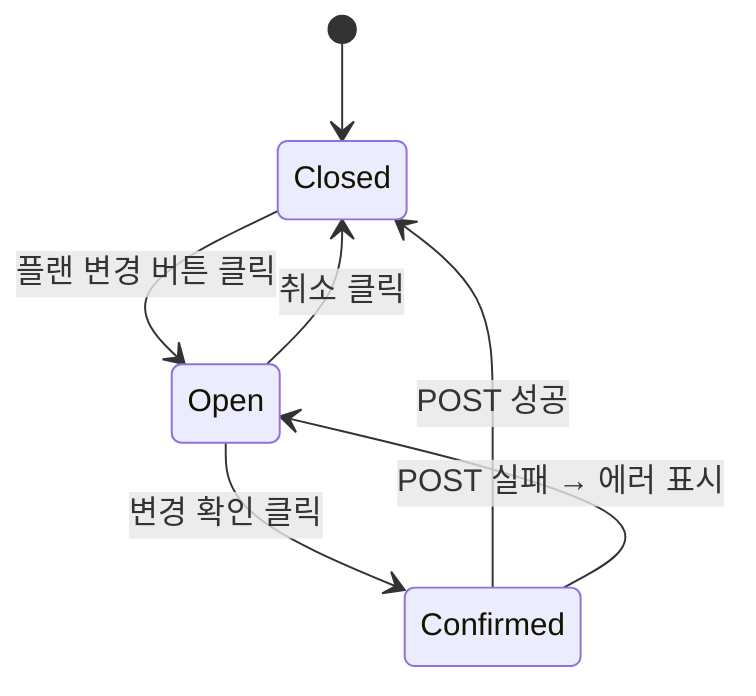

## 다이어그램

## 모달 속성
| 항목 | 값 |
|------|-----|
| variant | primary |
| title | 플랜 변경 |
| description | {} → {} 플랜으로 변경합니다. 다음 결제일부터 새 플랜이 적용됩니다. |
| | 변경 확인 |
| | 취소 |
| content | 플랜 비교표 (현재/변경 플랜 나란히) |
