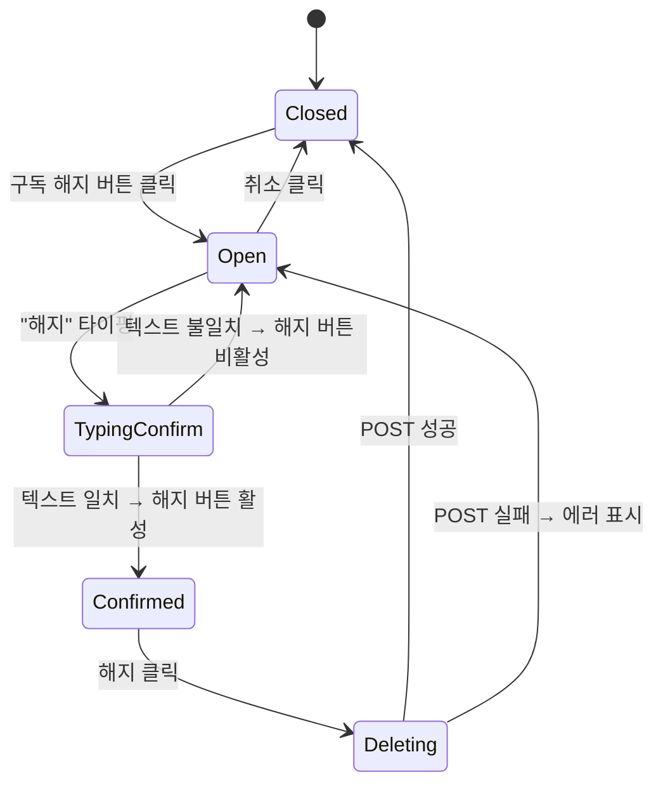

## 다이어그램

```mermaid
stateDiagram-v2
    [*] --> Closed
    Closed --> Open: 구독 해지 버튼 클릭
    Open --> TypingConfirm: "해지" 타이핑
    TypingConfirm --> Confirmed: 텍스트 일치 → 해지 버튼 활성
    TypingConfirm --> Open: 텍스트 불일치 → 해지 버튼 비활성
    Confirmed --> Deleting: 해지 클릭
    Deleting --> Closed: POST 성공
    Deleting --> Open: POST 실패 → 에러 표시
    Open --> Closed: 취소 클릭
```

## 모달 속성
| 항목 | 값 |
|------|-----|
| variant | danger |
| title | 구독 해지 |
| description | 구독을 해지하면 현재 결제 기간 종료 후 서비스가 중단됩니다. 해지를 확인하려면 "해지"를 입력해 주세요. |
| | 해지 확인 |
| | 취소 |
| | 해지 |
