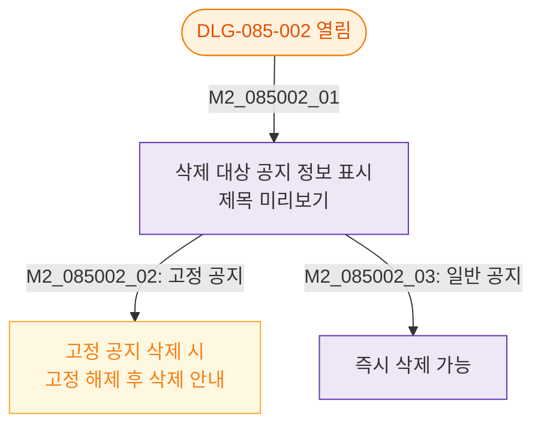

## 다이어그램

```mermaid
flowchart TD
    Open([DLG-085-002 열림]) -->|M2_085002_01|ShowInfo[삭제 대상 공지 정보 표시\n제목 미리보기]
    ShowInfo -->|"M2_085002_02: 고정 공지"|PinnedWarning[고정 공지 삭제 시\n고정 해제 후 삭제 안내]
    ShowInfo -->|"M2_085002_03: 일반 공지"|NormalDelete[즉시 삭제 가능]

    classDef modal fill:#FFF3E0,stroke:#F57C00,color:#E65100
    classDef warning fill:#FFF8E1,stroke:#F9A825,color:#F57F17
    classDef system fill:#EDE7F6,stroke:#5E35B2
    class Open modal
    class PinnedWarning warning
    class ShowInfo,NormalDelete system
```
