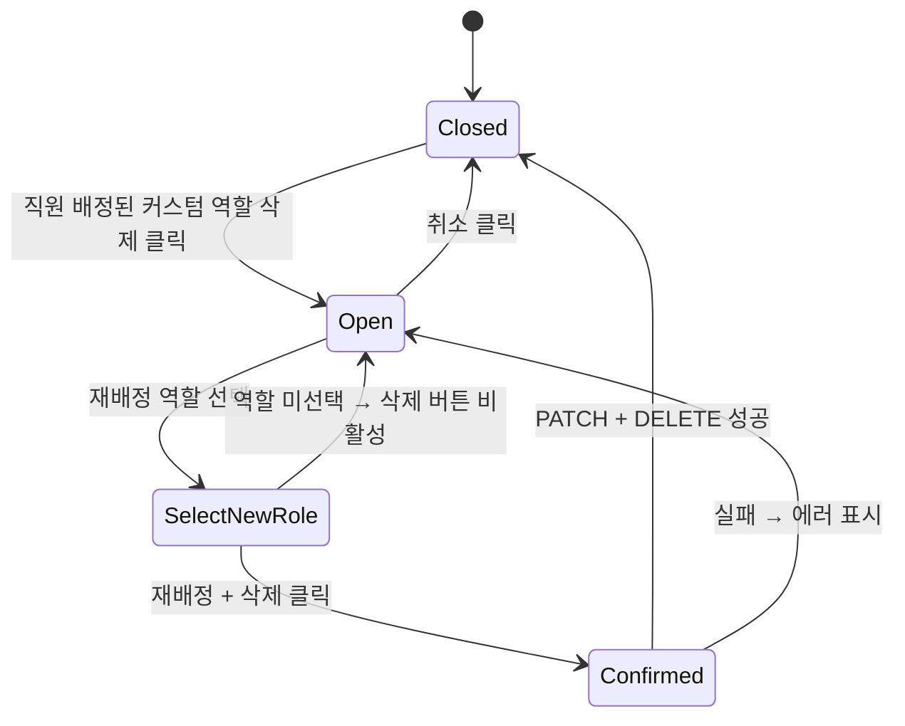

## 다이어그램

## 모달 속성
| 항목 | 값 |
|------|-----|
| variant | danger |
| title | 역할 삭제 — 직원 재배정 필요 |
| description | 이 역할에 배정된 직원 {count}명을 다른 역할로 재배정한 후 삭제할 수 있습니다. |
| | 재배정 후 삭제 |
| | 취소 |
| fields | 재배정 역할 Select (필수) |
