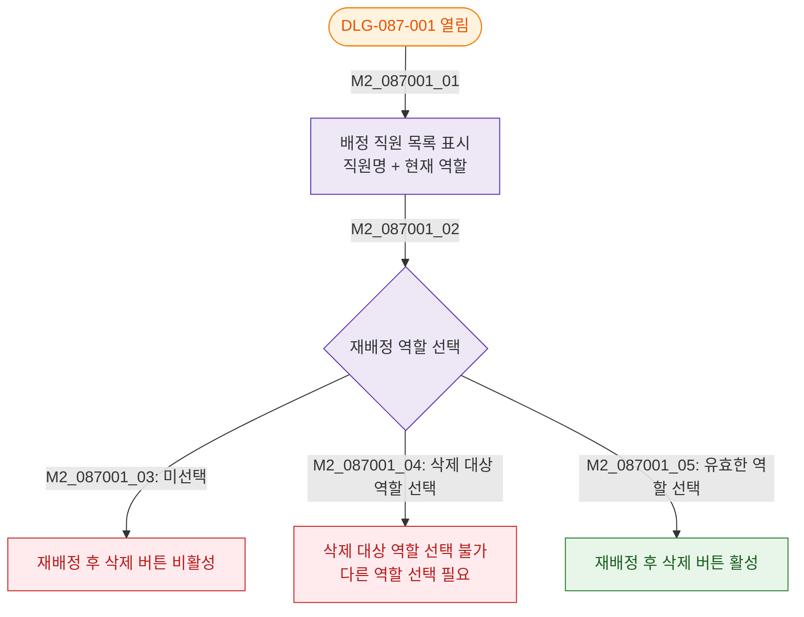

## 다이어그램

```mermaid
flowchart TD
    Open([DLG-087-001 열림]) -->|M2_087001_01|ShowStaff[배정 직원 목록 표시\n직원명 + 현재 역할]
    ShowStaff -->|M2_087001_02|RoleSelect{재배정 역할 선택}
    RoleSelect -->|"M2_087001_03: 미선택"|BtnDisabled[재배정 후 삭제 버튼 비활성]
    RoleSelect -->|"M2_087001_04: 삭제 대상 역할 선택"|E_SameRole[삭제 대상 역할 선택 불가\n다른 역할 선택 필요]
    RoleSelect -->|"M2_087001_05: 유효한 역할 선택"|BtnEnabled[재배정 후 삭제 버튼 활성]

    classDef modal fill:#FFF3E0,stroke:#F57C00,color:#E65100
    classDef error fill:#FFEBEE,stroke:#C62828,color:#B71C1C
    classDef success fill:#E8F5E9,stroke:#2E7D32,color:#1B5E20
    classDef system fill:#EDE7F6,stroke:#5E35B2
    class Open modal
    class E_SameRole,BtnDisabled error
    class BtnEnabled success
    class ShowStaff,RoleSelect system
```
