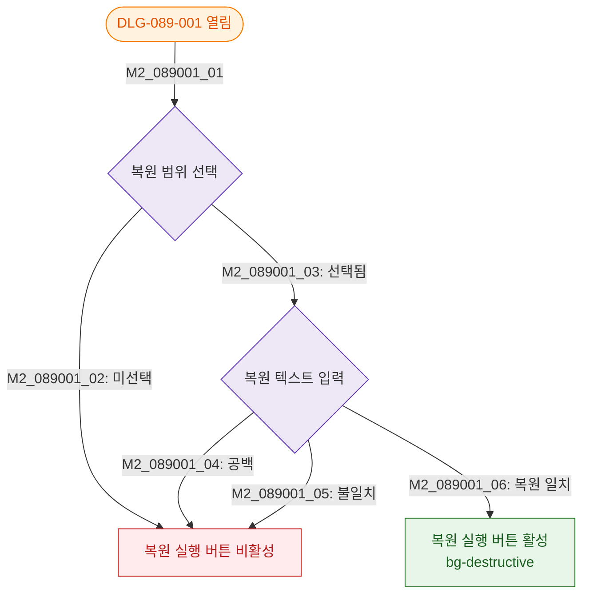

## 다이어그램

```mermaid
flowchart TD
    Open([DLG-089-001 열림]) -->|M2_089001_01|ScopeSelect{복원 범위 선택}
    ScopeSelect -->|"M2_089001_02: 미선택"|BtnDisabled[복원 실행 버튼 비활성]
    ScopeSelect -->|"M2_089001_03: 선택됨"|TypeInput{복원 텍스트 입력}

    TypeInput -->|"M2_089001_04: 공백"|BtnDisabled
    TypeInput -->|"M2_089001_05: 불일치"|BtnDisabled
    TypeInput -->|"M2_089001_06: 복원 일치"|BtnEnabled[복원 실행 버튼 활성\nbg-destructive]

    classDef modal fill:#FFF3E0,stroke:#F57C00,color:#E65100
    classDef error fill:#FFEBEE,stroke:#C62828,color:#B71C1C
    classDef success fill:#E8F5E9,stroke:#2E7D32,color:#1B5E20
    classDef system fill:#EDE7F6,stroke:#5E35B2
    class Open modal
    class BtnEnabled success
    class BtnDisabled error
    class ScopeSelect,TypeInput system
```
