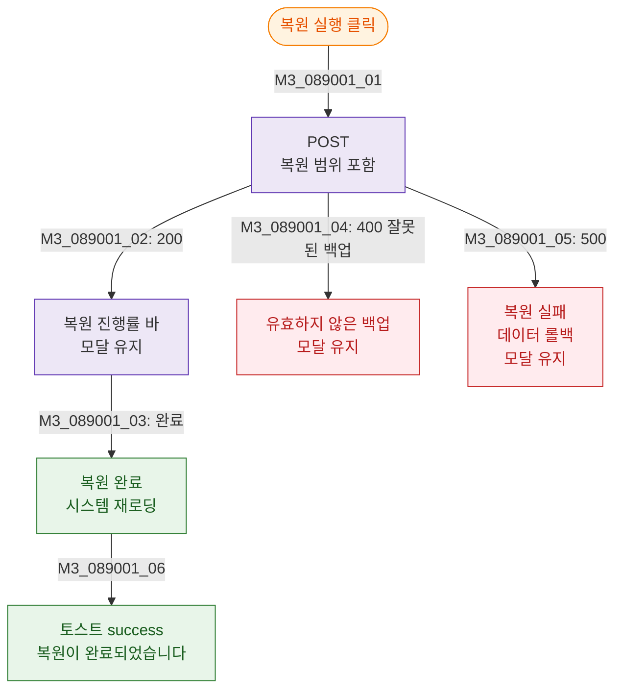

## 다이어그램

```mermaid
flowchart TD
    Action([복원 실행 클릭]) -->|M3_089001_01|ACT_Restore[POST \n복원 범위 포함]
    ACT_Restore -->|"M3_089001_02: 200"|RestoreProgress[복원 진행률 바\n모달 유지]
    RestoreProgress -->|"M3_089001_03: 완료"|RestoreOK[복원 완료\n시스템 재로딩]
    ACT_Restore -->|"M3_089001_04: 400 잘못된 백업"|E_Invalid[유효하지 않은 백업\n모달 유지]
    ACT_Restore -->|"M3_089001_05: 500"|E_Server[복원 실패\n데이터 롤백\n모달 유지]

    RestoreOK -->|M3_089001_06|T_RestoreOK[토스트 success\n복원이 완료되었습니다]

    classDef modal fill:#FFF3E0,stroke:#F57C00,color:#E65100
    classDef success fill:#E8F5E9,stroke:#2E7D32,color:#1B5E20
    classDef error fill:#FFEBEE,stroke:#C62828,color:#B71C1C
    classDef system fill:#EDE7F6,stroke:#5E35B2
    class Action modal
    class RestoreOK,T_RestoreOK success
    class E_Invalid,E_Server error
    class ACT_Restore,RestoreProgress system
```
