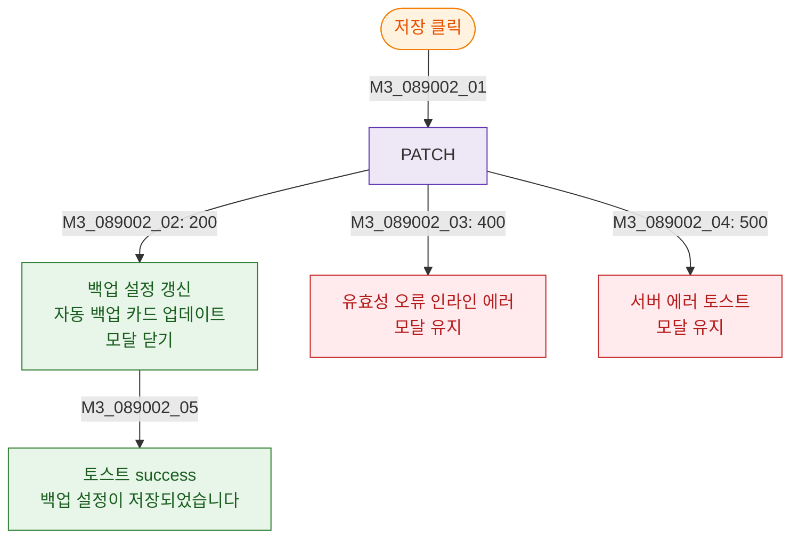

## 다이어그램

```mermaid
flowchart TD
    Action([저장 클릭]) -->|M3_089002_01|ACT_Save[PATCH]
    ACT_Save -->|"M3_089002_02: 200"|SaveOK[백업 설정 갱신\n자동 백업 카드 업데이트\n모달 닫기]
    ACT_Save -->|"M3_089002_03: 400"|E_Validation[유효성 오류 인라인 에러\n모달 유지]
    ACT_Save -->|"M3_089002_04: 500"|E_Server[서버 에러 토스트\n모달 유지]

    SaveOK -->|M3_089002_05|T_SaveOK[토스트 success\n백업 설정이 저장되었습니다]

    classDef modal fill:#FFF3E0,stroke:#F57C00,color:#E65100
    classDef success fill:#E8F5E9,stroke:#2E7D32,color:#1B5E20
    classDef error fill:#FFEBEE,stroke:#C62828,color:#B71C1C
    classDef system fill:#EDE7F6,stroke:#5E35B2
    class Action modal
    class SaveOK,T_SaveOK success
    class E_Validation,E_Server error
    class ACT_Save system
```
