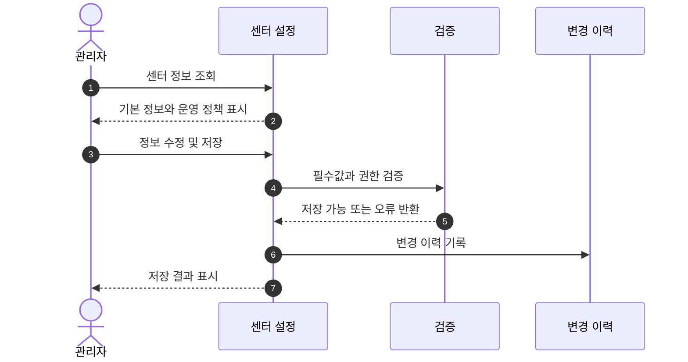

# SCR-080 센터 설정 메인 인터랙션

```mermaid
sequenceDiagram
    autonumber
    actor Admin as 관리자
    participant Screen as 센터 설정
    participant Validator as 검증
    participant Log as 변경 이력

    Admin->>Screen: 센터 정보 조회
    Screen-->>Admin: 기본 정보와 운영 정책 표시
    Admin->>Screen: 정보 수정 및 저장
    Screen->>Validator: 필수값과 권한 검증
    Validator-->>Screen: 저장 가능 또는 오류 반환
    Screen->>Log: 변경 이력 기록
    Screen-->>Admin: 저장 결과 표시
```
