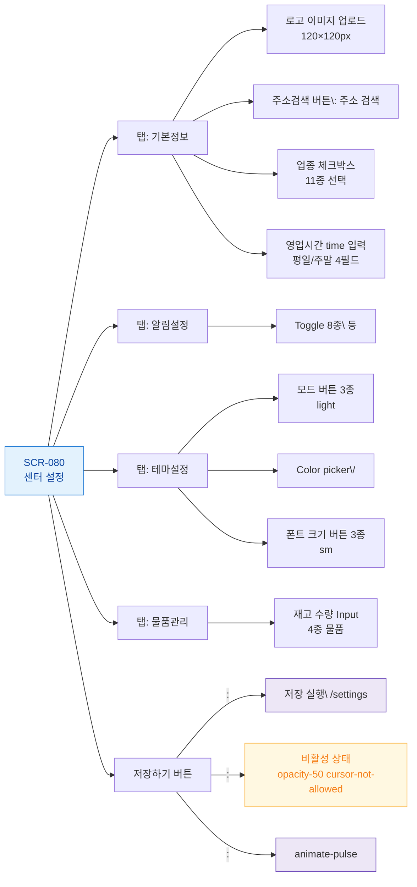

## 목적
SCR-080의 모든 버튼 및 인터랙티브 요소를 노드화하고 각 동작을 매핑한다.

## 다이어그램

## TC 후보
- TC-080-007: 업종 체크박스 "헬스" → sectors 배열에 추가
- TC-080-008: 평일 영업시간 09:00~22:00 입력 → / 업데이트
- TC-080-009: 알림 Toggle ON → 
- TC-080-010: 테마 "다크" 선택 → mode="dark"
- TC-080-011: 주요 색상 #FF0000 → 업데이트
- TC-080-012: 폰트 "크게" → 
- TC-080-013: 수건(대) 재고=200 입력 → =200
- TC-080-014: → 저장 버튼 opacity-50 + cursor-not-allowed
