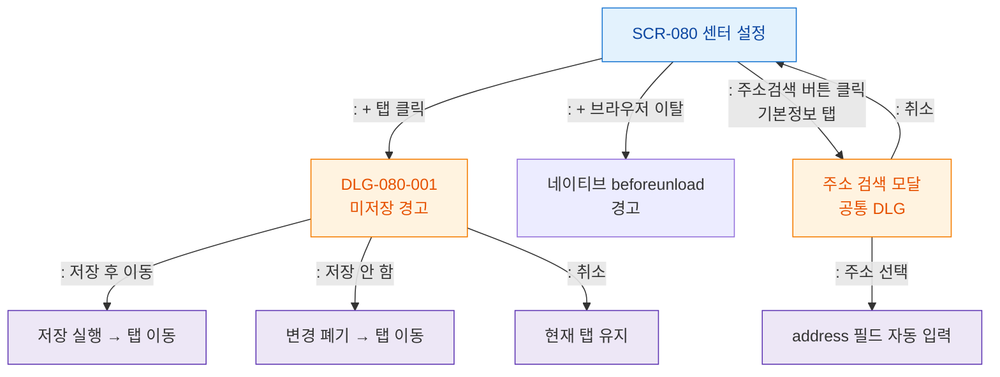

## 목적
SCR-080에서 발생하는 모든 모달/다이얼로그 트리거 경로를 정의한다.

## 다이어그램

## TC 후보
- TC-080-004: → 탭 클릭 → DLG-080-001 표시
- TC-080-005: 미저장 경고 → "저장 후 이동" → 저장 + 탭 이동
- TC-080-006: 미저장 경고 → "저장 안 함" → 변경 폐기 + 탭 이동
- TC-080-015: → 브라우저 탭 닫기 → beforeunload 경고
