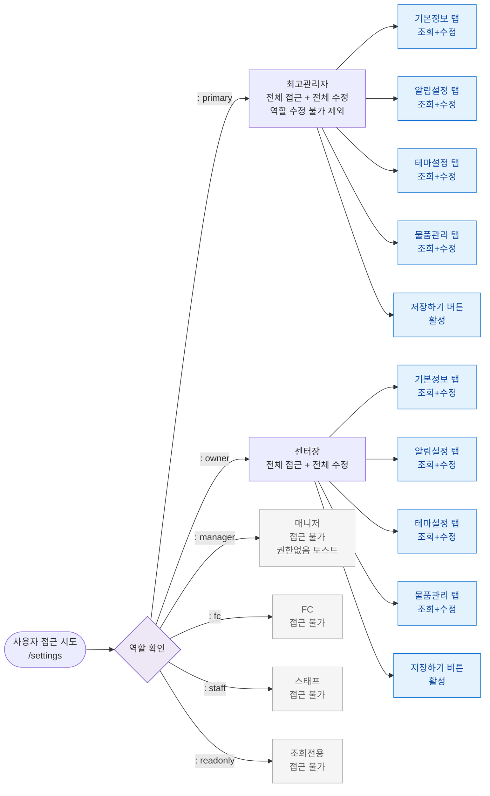

## 목적
SCR-080에 대한 6개 역할별 접근 및 액션 가능 범위를 정의한다. 설정 도메인은 primary/owner 중심.

## 다이어그램

## 엣지 설명
| 역할 | 접근 | 조회 | 수정 | 저장 |
|------|:---:|:---:|:---:|:---:|
| primary | ✅ | ✅ | ✅ | ✅ |
| owner | ✅ | ✅ | ✅ | ✅ |
| manager | ❌ | ❌ | ❌ | ❌ |
| fc | ❌ | ❌ | ❌ | ❌ |
| staff | ❌ | ❌ | ❌ | ❌ |
| readonly | ❌ | ❌ | ❌ | ❌ |

## TC 후보
- TC-080-NEG-001: manager 로그인 → /settings 접근 → 권한없음 토스트
- TC-080-NEG-005: readonly 로그인 → /settings URL 직접 입력 → 차단
