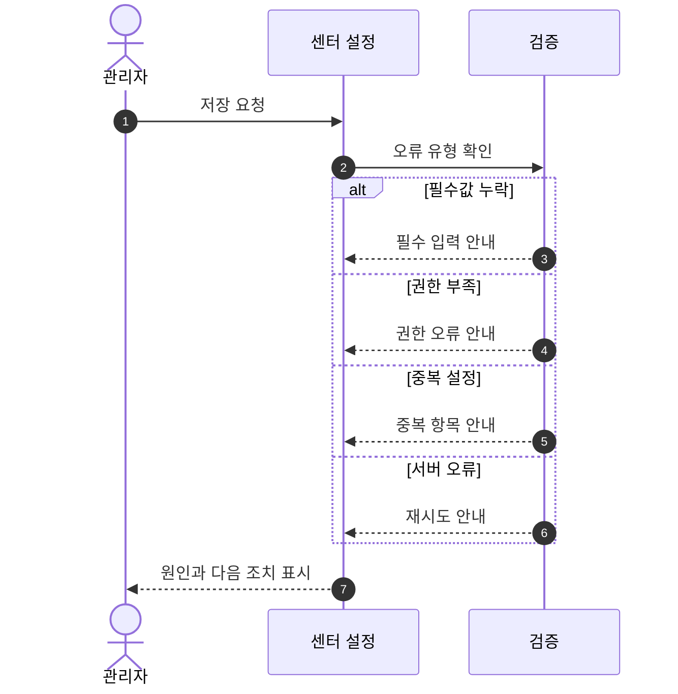

# SCR-080 센터 설정 에러 예외 복구

```mermaid
sequenceDiagram
    autonumber
    actor Admin as 관리자
    participant Screen as 센터 설정
    participant Validator as 검증

    Admin->>Screen: 저장 요청
    Screen->>Validator: 오류 유형 확인
    alt 필수값 누락
        Validator-->>Screen: 필수 입력 안내
    else 권한 부족
        Validator-->>Screen: 권한 오류 안내
    else 중복 설정
        Validator-->>Screen: 중복 항목 안내
    else 서버 오류
        Validator-->>Screen: 재시도 안내
    end
    Screen-->>Admin: 원인과 다음 조치 표시
```
