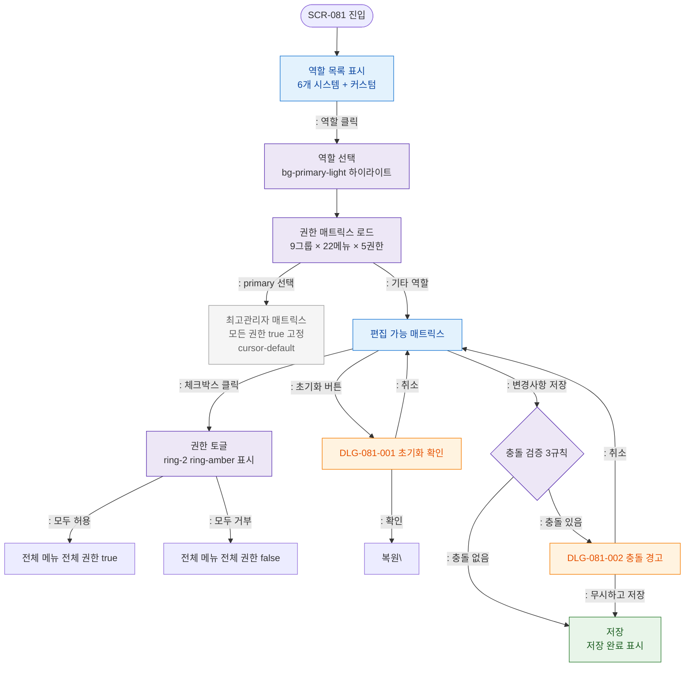

## 목적
권한 설정 화면의 정상 시나리오: 역할 선택 → 매트릭스 조작 → 충돌 검증 → 저장

## 다이어그램

## TC 후보
- TC-081-001: 매니저 역할 클릭 → 매트릭스 표시
- TC-081-002: 최고관리자 선택 → 체크박스 변경 불가 (cursor-default)
- TC-081-003: 센터장 → 회원 목록 삭제 권한 클릭 → 토글 + ring-amber
- TC-081-004: 모두 허용 → 22메뉴 × 5권한 전체 true
- TC-081-006: 충돌 감지 → DLG-081-002 표시
- TC-081-007: 충돌 경고 → "무시하고 저장" → 저장
- TC-081-008: 초기화 → 확인 → 복원
