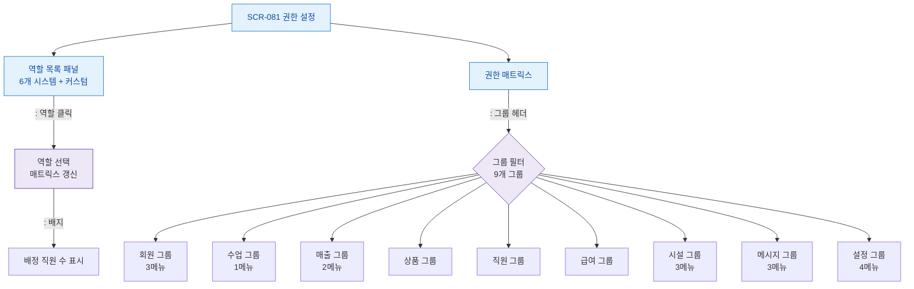

## 목적
권한 설정에서 역할 목록 탐색 및 매트릭스 내 필터링 조작을 정의한다.

## 다이어그램

```mermaid
flowchart TD
    SCR081[SCR-081 권한 설정]

    SCR081 --> RoleList[역할 목록 패널\n6개 시스템 + 커스텀]
    RoleList -->|": 역할 클릭"|SelRole[역할 선택\n매트릭스 갱신]
    SelRole -->|": 배지"|ShowCount[배정 직원 수 표시]

    SCR081 --> Matrix[권한 매트릭스]
    Matrix -->|": 그룹 헤더"|GroupFilter{그룹 필터\n9개 그룹}
    GroupFilter --> G_Member[회원 그룹\n3메뉴]
    GroupFilter --> G_Class[수업 그룹\n1메뉴]
    GroupFilter --> G_Sales[매출 그룹\n2메뉴]
    GroupFilter --> G_Product[상품 그룹]
    GroupFilter --> G_Staff[직원 그룹]
    GroupFilter --> G_Salary[급여 그룹]
    GroupFilter --> G_Facility[시설 그룹\n3메뉴]
    GroupFilter --> G_Message[메시지 그룹\n3메뉴]
    GroupFilter --> G_Settings[설정 그룹\n4메뉴]

    classDef screen fill:#E3F2FD,stroke:#1976D2,color:#0D47A1
    classDef system fill:#EDE7F6,stroke:#5E35B2
    class SCR081,RoleList,Matrix screen
    class GroupFilter,SelRole system
```

## TC 후보
- TC-081-001: 역할 클릭 → 해당 역할 매트릭스 표시
- TC-081-013: 직원 배정된 역할 → 배지 표시
