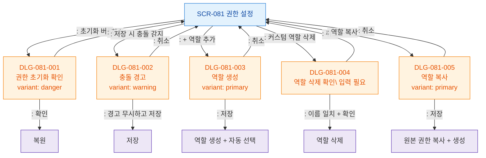

## 목적
SCR-081에서 트리거되는 모든 모달 경로를 정의한다.

## 다이어그램

## TC 후보
- TC-081-006: 충돌 감지 → DLG-081-002 표시
- TC-081-008: 초기화 → DLG-081-001 → 확인 → 복원
- TC-081-009: + 추가 → DLG-081-003 → 역할 생성
- TC-081-010: 기준 역할 복사 → DLG-081-005 → 권한 복사된 역할 생성
- TC-081-011: 커스텀 역할 삭제 → DLG-081-004 → 이름 타이핑 → 삭제
