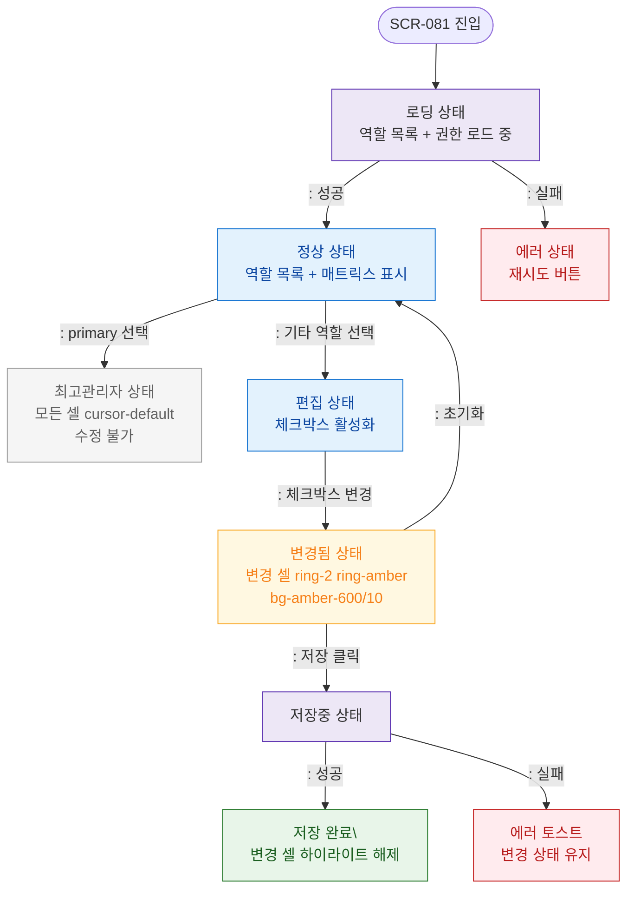

## 목적
SCR-081의 각 UI 상태(로딩/정상/변경됨/저장중/에러/권한없음)를 정의한다.

## 다이어그램

```mermaid
flowchart TD
    Entry([SCR-081 진입]) --> Loading[로딩 상태\n역할 목록 + 권한 로드 중]
    Loading -->|": 성공"|Normal[정상 상태\n역할 목록 + 매트릭스 표시]
    Loading -->|": 실패"|ErrorState[에러 상태\n재시도 버튼]

    Normal -->|": primary 선택"|PrimaryState[최고관리자 상태\n모든 셀 cursor-default\n수정 불가]
    Normal -->|": 기타 역할 선택"|EditState[편집 상태\n체크박스 활성화]

    EditState -->|": 체크박스 변경"|ChangedState[변경됨 상태\n변경 셀 ring-2 ring-amber\nbg-amber-600/10]
    ChangedState -->|": 저장 클릭"|SavingState[저장중 상태]
    SavingState -->|": 성공"|SavedState[저장 완료\\n변경 셀 하이라이트 해제]
    SavingState -->|": 실패"|ErrorToast[에러 토스트\n변경 상태 유지]

    ChangedState -->|": 초기화"|Normal

    classDef screen fill:#E3F2FD,stroke:#1976D2,color:#0D47A1
    classDef error fill:#FFEBEE,stroke:#C62828,color:#B71C1C
    classDef success fill:#E8F5E9,stroke:#2E7D32,color:#1B5E20
    classDef warning fill:#FFF8E1,stroke:#F9A825,color:#F57F17
    classDef system fill:#EDE7F6,stroke:#5E35B2
    classDef rbacBlocked fill:#F5F5F5,stroke:#9E9E9E,color:#616161
    class Normal,EditState screen
    class ErrorState,ErrorToast error
    class SavedState success
    class ChangedState warning
    class Loading,SavingState system
    class PrimaryState rbacBlocked
```

## TC 후보
- TC-081-002: 최고관리자 선택 → cursor-default, 변경 불가
- TC-081-003: 권한 토글 → ring-2 ring-amber 표시
