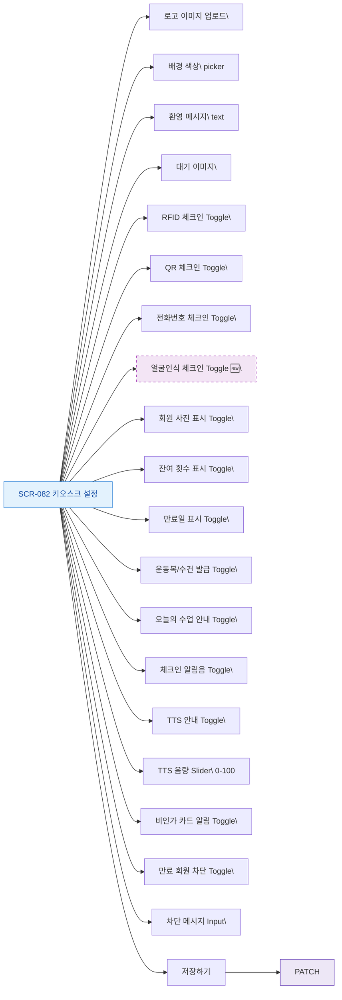

## 다이어그램

```mermaid
flowchart LR
    SCR082[SCR-082 키오스크 설정]

    SCR082 --> BTN_LOGO[로고 이미지 업로드\]
    SCR082 --> BTN_BG[배경 색상\ picker]
    SCR082 --> BTN_WELCOME[환영 메시지\ text]
    SCR082 --> BTN_IDLE[대기 이미지\]

    SCR082 --> TGL_RFID[RFID 체크인 Toggle\]
    SCR082 --> TGL_QR[QR 체크인 Toggle\]
    SCR082 --> TGL_PHONE[전화번호 체크인 Toggle\]
    SCR082 --> TGL_FACE[얼굴인식 체크인 Toggle 🆕\]

    SCR082 --> TGL_PHOTO[회원 사진 표시 Toggle\]
    SCR082 --> TGL_REMAIN[잔여 횟수 표시 Toggle\]
    SCR082 --> TGL_EXPIRY[만료일 표시 Toggle\]
    SCR082 --> TGL_SUPPLY[운동복/수건 발급 Toggle\]
    SCR082 --> TGL_CLASS[오늘의 수업 안내 Toggle\]

    SCR082 --> TGL_BEEP[체크인 알림음 Toggle\]
    SCR082 --> TGL_TTS[TTS 안내 Toggle\]
    SCR082 --> SLD_TTS[TTS 음량 Slider\ 0-100]

    SCR082 --> TGL_ALERT[비인가 카드 알림 Toggle\]
    SCR082 --> TGL_BLOCK[만료 회원 차단 Toggle\]
    SCR082 --> INP_BLOCKMSG[차단 메시지 Input\]

    SCR082 --> BTN_SAVE[저장하기]
    BTN_SAVE --> ACT_SAVE[PATCH]

    classDef screen fill:#E3F2FD,stroke:#1976D2,color:#0D47A1
    classDef newFeature fill:#F3E5F5,stroke:#9C27B0,stroke-dasharray:5 5
    classDef system fill:#EDE7F6,stroke:#5E35B2
    class SCR082 screen
    class TGL_FACE newFeature
    class ACT_SAVE system
```

## TC 후보
- TC-082-002: RFID Toggle → 변경
- TC-082-004: TTS 음량 슬라이더 조작
- TC-082-005: 차단 메시지 입력 → 업데이트
