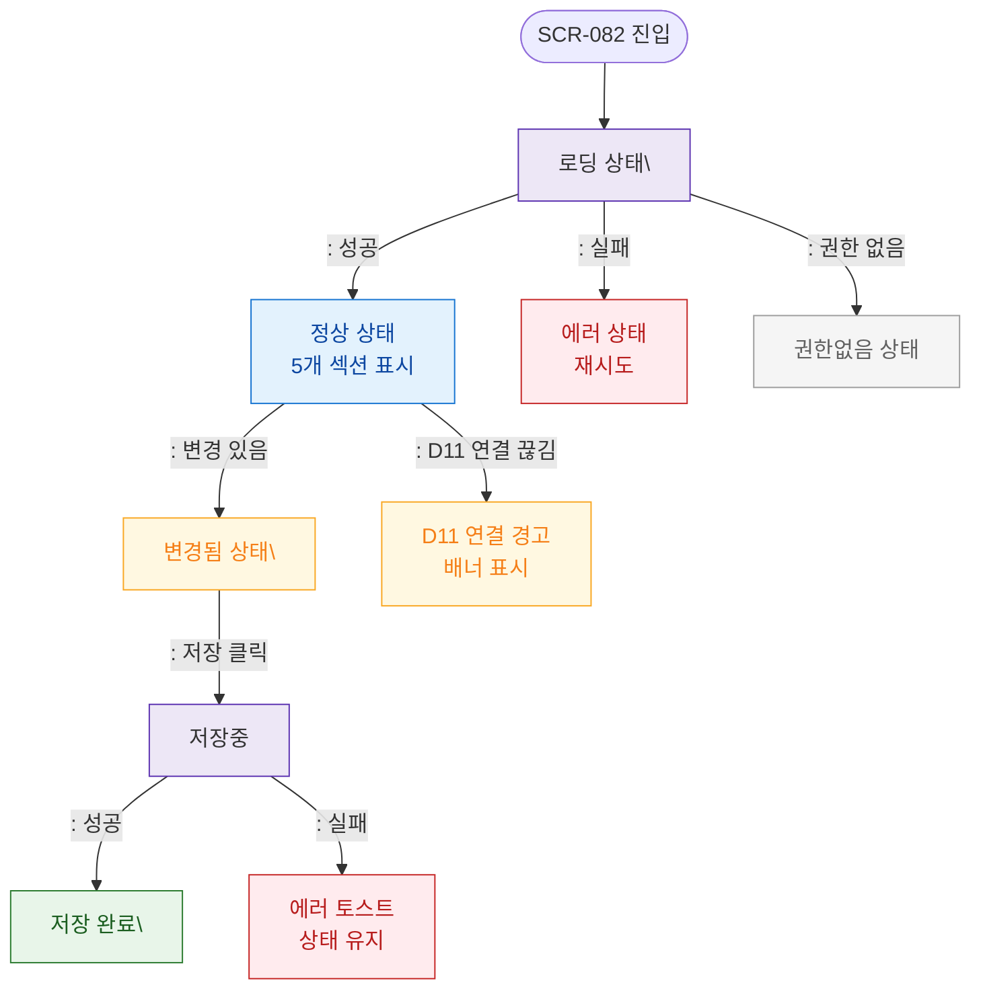

## 다이어그램

```mermaid
flowchart TD
    Entry([SCR-082 진입]) --> Loading[로딩 상태\]
    Loading -->|": 성공"|Normal[정상 상태\n5개 섹션 표시]
    Loading -->|": 실패"|ErrorState[에러 상태\n재시도]
    Loading -->|": 권한 없음"|NoAuth[권한없음 상태]

    Normal -->|": 변경 있음"|Dirty[변경됨 상태\]
    Dirty -->|": 저장 클릭"|Saving[저장중]
    Saving -->|": 성공"|Saved[저장 완료\]
    Saving -->|": 실패"|SaveFail[에러 토스트\n상태 유지]

    Normal -->|": D11 연결 끊김"|DisconnectWarn[D11 연결 경고\n배너 표시]

    classDef screen fill:#E3F2FD,stroke:#1976D2,color:#0D47A1
    classDef error fill:#FFEBEE,stroke:#C62828,color:#B71C1C
    classDef success fill:#E8F5E9,stroke:#2E7D32,color:#1B5E20
    classDef warning fill:#FFF8E1,stroke:#F9A825,color:#F57F17
    classDef system fill:#EDE7F6,stroke:#5E35B2
    classDef rbacBlocked fill:#F5F5F5,stroke:#9E9E9E,color:#616161
    class Normal screen
    class ErrorState,SaveFail error
    class Saved success
    class Dirty,DisconnectWarn warning
    class Loading,Saving system
    class NoAuth rbacBlocked
```

## TC 후보
- TC-082-008: 설정 로드 실패 → 에러 상태 + 재시도
