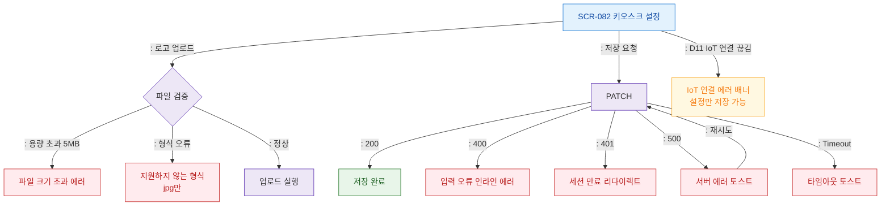

## 다이어그램

```mermaid
flowchart TD
    SCR082[SCR-082 키오스크 설정]

    SCR082 -->|": 로고 업로드"|UploadCheck{파일 검증}
    UploadCheck -->|": 용량 초과 5MB"|E_Size[파일 크기 초과 에러]
    UploadCheck -->|": 형식 오류"|E_Type[지원하지 않는 형식\njpg만]
    UploadCheck -->|": 정상"|Upload[업로드 실행]

    SCR082 -->|": 저장 요청"|SaveReq[PATCH]
    SaveReq -->|": 200"|SaveOK[저장 완료]
    SaveReq -->|": 400"|E_Valid[입력 오류 인라인 에러]
    SaveReq -->|": 401"|E_Auth[세션 만료 리다이렉트]
    SaveReq -->|": 500"|E_Server[서버 에러 토스트]
    SaveReq -->|": Timeout"|E_Timeout[타임아웃 토스트]

    SCR082 -->|": D11 IoT 연결 끊김"|E_IoT[IoT 연결 에러 배너\n설정만 저장 가능]

    E_Server -->|": 재시도"|SaveReq

    classDef screen fill:#E3F2FD,stroke:#1976D2,color:#0D47A1
    classDef error fill:#FFEBEE,stroke:#C62828,color:#B71C1C
    classDef success fill:#E8F5E9,stroke:#2E7D32,color:#1B5E20
    classDef system fill:#EDE7F6,stroke:#5E35B2
    classDef warning fill:#FFF8E1,stroke:#F9A825,color:#F57F17
    class SCR082 screen
    class E_Size,E_Type,E_Valid,E_Auth,E_Server,E_Timeout error
    class SaveOK success
    class E_IoT warning
    class UploadCheck,SaveReq,Upload system
```

## TC 후보
- TC-082-008: 저장 API 500 → 에러 토스트
- TC-082-NEG-002: 로고 5MB 초과 → 에러 메시지
