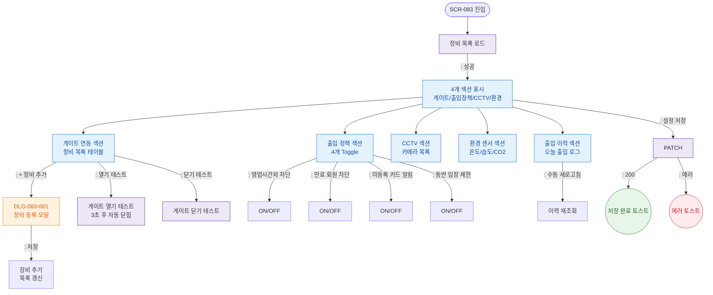

## 목적
IoT 장비 관리, 출입 정책 설정, CCTV, 환경 센서, 출입 이력 조회 정상 시나리오.

## 다이어그램

## TC 후보
- TC-083-002: 장비 추가 → DLG-083-001 → 저장 → 목록 갱신
- TC-083-003: 게이트 열기 테스트 → 3초 후 자동 닫힘
- TC-083-004: 만료 회원 차단 Toggle ON → 
- TC-083-005: 출입 이력 테이블 표시 → 시간/회원명/방식/결과 컬럼
