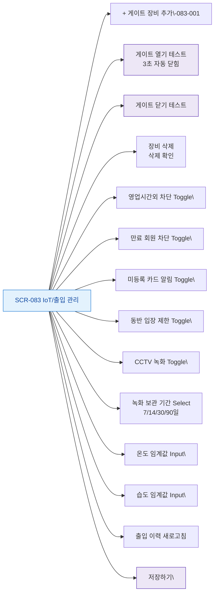

## 다이어그램

```mermaid
flowchart LR
    SCR083[SCR-083 IoT/출입 관리]

    SCR083 --> BTN_ADD_GATE[+ 게이트 장비 추가\-083-001]
    SCR083 --> BTN_OPEN[게이트 열기 테스트\n3초 자동 닫힘]
    SCR083 --> BTN_CLOSE[게이트 닫기 테스트]
    SCR083 --> BTN_DEL_GATE[장비 삭제\n삭제 확인]

    SCR083 --> TGL_AFTER[영업시간외 차단 Toggle\]
    SCR083 --> TGL_EXPIRED[만료 회원 차단 Toggle\]
    SCR083 --> TGL_UNREG[미등록 카드 알림 Toggle\]
    SCR083 --> TGL_COMPANION[동반 입장 제한 Toggle\]

    SCR083 --> TGL_REC[CCTV 녹화 Toggle\]
    SCR083 --> SEL_RETAIN[녹화 보관 기간 Select\n7/14/30/90일]

    SCR083 --> INP_TEMP[온도 임계값 Input\]
    SCR083 --> INP_HUMID[습도 임계값 Input\]

    SCR083 --> BTN_REFRESH_LOG[출입 이력 새로고침]
    SCR083 --> BTN_SAVE[저장하기\]

    classDef screen fill:#E3F2FD,stroke:#1976D2,color:#0D47A1
    classDef system fill:#EDE7F6,stroke:#5E35B2
    class SCR083 screen
    class BTN_OPEN,BTN_CLOSE,BTN_SAVE system
```

## TC 후보
- TC-083-002: + 장비 추가 → DLG-083-001 트리거
- TC-083-003: 게이트 열기 테스트 → 3초 후 자동 닫힘
- TC-083-004: 만료 회원 차단 Toggle → 변경
